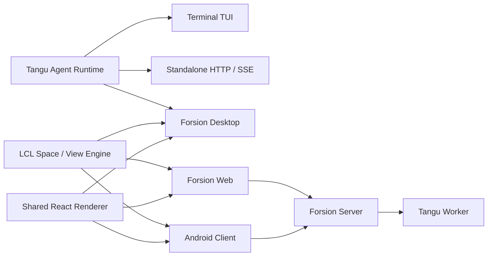

<div align="center">


# Forsion

**Remember it. Think it through. Keep it moving.**<br>
A local-first AI second brain you own.

**English** · [简体中文](./README.zh-CN.md)

[](https://github.com/Changan-Su/Forsion/releases)

[](./LICENSE)

[Download](https://github.com/Changan-Su/Forsion/releases/latest) · [Quick start](./docs/getting-started/quickstart.en.md) · [Documentation (中文)](./docs/README.md) · [Website](https://forsion.net)

</div>

Forsion is a **local-first AI second brain**. Organize your own Markdown files in a Notion-style block editor, think with Agents that retain useful context, build a TEAM to move projects forward, and let Muse follow up within the boundaries you set.

**Make each piece of thinking a starting point for the next.** Sources, preferences, discussions, outputs, and follow-ups come together in one workspace.

| Part of your second brain | How it works in Forsion |
| --- | --- |
| **Capture and connect** | Block editing on local `.md` files, linked to notes, PDFs, whiteboards, databases, and conversations. |
| **Remember context** | Inspectable, editable long-term memory that carries preferences and project background across conversations. |
| **Think and act together** | Agents with distinct personalities, persistent TEAMs, parallel work, and Team Desk. |
| **Follow through** | Muse wakes on heartbeats, schedules, and rules, bringing results and decisions to Inbox. |
| **Extend your workflow** | Plugins bring tools, Agents, skills, and dedicated workspaces into the same flow. |

## Markdown files. A block editor you can think in.

**Notion-style block editing, built on local `.md` files.** In the Amadeus knowledge base, headings, paragraphs, to-dos, code, and embedded content become blocks you can organize. Write with Markdown shortcuts, insert content with `/`, arrange sources in columns, and inspect block source. Your notes remain files on disk that you can open, back up, and ask an Agent to read or update.

- **Give a page structure.** Markdown shortcuts, slash commands, columns, section folding, callouts, page icons, and covers help organize longer notes.
- **Connect your material.** Use `[[wikilinks]]`, backlinks, and a graph to connect ideas. Embed notes, images, databases, and whiteboards; reference notes directly in chat.
- **Put sources to work.** Within the access you authorize, Agents can read sources, compare approaches, and write conclusions and next steps back to the project. You and your Agents work with the same actual files.

| A way to think or work | The tools to support it |
| --- | --- |
| Organize structured research and projects | Databases with table, board, calendar, and gallery views, plus filtering, sorting, and grouping. |
| Explore relationships and reasoning | Excalidraw-compatible whiteboards; PDF annotations saved into the PDF itself. |
| Build a project home | Dashboards combining notes, databases, whiteboards, images, and webpage cards. |
| Bring next steps into your day | Calendar aggregates database dates and to-dos, with external calendar subscriptions. |

Notes use local Markdown, with compatible formats for links, properties, and whiteboards. Rendering of extensions such as columns, databases, and plugin blocks depends on the application opening them.

[Block editor (中文)](./docs/amadeus/editor.md) · [Knowledge base (中文)](./docs/amadeus/overview.md) · [Databases (中文)](./docs/amadeus/databases.md) · [Whiteboards (中文)](./docs/amadeus/whiteboard.md)

## Keep the background worth carrying forward

**Your knowledge base holds the material. Memory carries useful context.** Full articles, evidence, and outputs stay in the project. Preferences, facts, and lasting background you explicitly share can become Agent memory, giving the next conversation somewhere to begin.

- **See what it remembers.** Inspect, revise, and organize memories in the memory panel. Check sources and revision history, or remove an item from active memory.
- **Give each Agent its own continuity.** Agents have a personality (SOUL), memory, Library, and work journal, with individually manageable models, tool permissions, and memory settings.
- **Maintain the accumulated context.** Historian organizes logs and memory candidates. Enable Dream when you want memory consolidation; conversation recall searches relevant history within the Agent's scope.

Try: “When helping me research, lead with conclusions, then sources, and call out uncertainty separately.” Check that it was saved, then start another conversation about the project and inspect how it uses that preference. Automatic Dream maintenance is off by default; forgetting removes active memory while retaining revision history.

[Memory (中文)](./docs/agents/memory.md) · [Configure Agents (中文)](./docs/agents/overview.md)

## TEAM: room for imagination, scrutiny, and shared work

**A solo project can still have different perspectives and lasting roles.** Aria attends to feeling and creative possibilities; Recita examines evidence, assumptions, and feasibility; Arioso weighs your aims and tradeoffs with independent judgment. Coding focuses on implementation, while Muse follows up proactively. Customize them or create your own Agents.

**TEAM in v2.11 makes collaboration something you can build on:**

- **Shared expectations.** Select two or more Agents to start team mode. Persistent teams retain members and roles, have a Library, and use `TEAM.md` for common goals and working agreements.
- **Parallel work.** Members research, write, or execute in their own child conversations, posting progress, questions, and handoffs to the main conversation. Interject or @ a member to keep the work focused.
- **Visible progress and outputs.** Team Desk shows who is working, awaiting approval, or done. Open a member's full child conversation; review approval requests and public outputs in the main conversation.
- **A home for each task.** Use `@project` in a private chat to dispatch work into a new conversation in that project. Agents Space manages Agents and teams; the Orbits sidebar brings private chats, teams, projects, and external engines together.

You can also delegate independent subtasks from an ordinary conversation or connect installed Claude Code and Codex engines through ACP. Teams and these local execution features use local mode. Context is passed as needed; Agent memories and tool settings remain individually managed.

[TEAM and Team Desk](./docs/chat/group-chat.en.md) · [Agents and personalities (中文)](./docs/agents/overview.md) · [External engines (中文)](./docs/agents/external-engines.md)

## Muse: keep the follow-up moving

**Hand ongoing work to a proactive Agent.** Once enabled, Muse wakes on heartbeats, schedules, and rules to review recent work, organize material, suggest next steps, or carry out tasks within configured permissions and budgets.

- **Hand over a next step.** Assign a conversation task card to Muse, or configure schedules and event rules. Heartbeats let it periodically revisit work worth moving forward.
- **Bring decisions back to you.** Results arrive in Inbox. Execute a task with Muse, continue in a new conversation, or dismiss it; approve or reject pending actions.
- **Give ongoing work a place.** Muse builds its own Library and journals, and can write and gradually improve its own Space to make that work browsable.

Muse is off by default and currently runs in local mode, with the device and relevant processes available. You set active hours, frequency, budgets, and approval behavior. For defined processes, **Automation** connects time, events, or database changes to Agent actions, notifications, and table operations.

[Proactive Muse (中文)](./docs/agents/muse.md) · [Automation (中文)](./docs/spaces/automation.md) · [Inbox (中文)](./docs/spaces/inbox.md)

## Plugins: bring your way of working

**Your second brain can grow with your work.** A plugin bundle can deliver an interface, engine tools, Agents, skills, and a Space together, connecting collection, processing, and output.

- **Collect and act.** Bluebird turns videos into notes; Computer Use lets Agents operate desktop applications on supported platforms; plugin events can trigger automation.
- **Reuse a method.** Skills preserve ways of doing tasks, MCP connects external tools and data, and plugins extend note blocks, views, and workspaces.
- **Build your own environment.** Install plugins, Agents, skills, Spaces, themes, and web apps from the marketplace. Agents can also use built-in extension-development skills to create extensions for you.

[Plugins (中文)](./docs/customization/plugins.md) · [Marketplace (中文)](./docs/customization/market.md) · [Skills (中文)](./docs/agents/skills.md)

## From a few sources to a research talk you can keep developing

Try building up this workflow with a real project:

1. **Create a project note.** Organize goals, sources, and questions with blocks; embed PDFs, whiteboards, or databases.
2. **Think with context.** Reference your material and a confirmed writing preference. Ask Aria to explore directions, Recita to examine evidence, and Arioso to help weigh the options.
3. **Divide the work with TEAM.** Assign independent investigations, drafts, or checks to members, then follow progress and outputs in Team Desk.
4. **Write decisions back to files.** Review the result and ask an Agent to save the outline, sources, and open questions. Inspect and edit them in Agent Desk; continue in Coding Studio if you need a webpage prototype.
5. **Leave a follow-up.** Ask Muse to revisit the project at an agreed time, handle its results in Inbox, and add new conclusions to the project.

This is a configurable example, dependent on the model, source access, and tools you choose. When you return, the project files and confirmed context give you a starting point.

<details>
<summary>Workspace screenshots: Note, Coding Studio, and Calendar (v2.10.4 public samples)</summary>

These real Electron workspace captures use isolated public sample data. They show how notes and outputs are organized in v2.10.4; they do not depict the v2.11 TEAM interface or a live model run.

<p align="center">
  
  <br><sub>Project material, ideas, and next steps in one note.</sub>
</p>
<p align="center">
  
  <br><sub>Coding Studio brings the conversation and webpage output together.</sub>
</p>
<p align="center">
  
  <br><sub>Calendar brings dated database records into your day.</sub>
</p>

</details>

## Work in an environment you control

- **Arrange your thinking space.** Spaces, split panels, draggable tabs, independent windows, and Mini Panel keep conversations, material, and outputs side by side, with restorable layouts.
- **Talk through the work.** Hands-free live voice sends after you pause; the call continues when you switch to other views.
- **Choose your models.** Use Forsion-hosted models, your own API connection, OpenAI-compatible endpoints, local Ollama, or supported subscription logins.
- **Reach Agents elsewhere.** Configure WeChat, Telegram, or QQ channels. Web and Android offer cloud-connected access, with capabilities that differ from Desktop.
- **Keep access to your accumulated work.** Inspect and back up local files, and edit memory. Cloud models, account sync, and sharing send the relevant content to the services involved.

[Workspace (中文)](./docs/getting-started/workspace.md) · [Channels (中文)](./docs/chat/channels.md) · [Client capabilities (中文)](./docs/reference/web-and-mobile.md) · [Data and privacy (中文)](./docs/reference/data-and-privacy.md)

## Download and start

Download the latest desktop installer from [GitHub Releases](https://github.com/Changan-Su/Forsion/releases/latest).

| Platform | Release artifact | Notes |
| --- | --- | --- |
| macOS | `Forsion-*.dmg` | Apple Silicon (arm64). |
| Windows | `Forsion-*.exe` | NSIS installer. |
| Linux | `Forsion-*.AppImage` | Add execute permission, then run. |

1. **Install and connect a model.** First launch helps configure your connection, model, and workspace. The desktop installer includes the Agent backend and Node.js runtime.
2. **Bring some real context.** Create a project note with a goal, sources, and next steps. Ask an Agent to read it, and explicitly tell it a preference worth remembering.
3. **Finish one useful task.** Ask an Agent to produce something from your material, inspect the saved file, and check an explicitly saved preference in the memory panel. Add TEAM, Muse, and plugins when you need them.

The [quick start](./docs/getting-started/quickstart.en.md) walks through this path and introduces multi-agent work and plugins.

> **Installer signing:** macOS builds use ad-hoc signing and are not yet notarized; Windows builds may trigger SmartScreen. Download from this repository's Releases. If Gatekeeper blocks the first open on macOS, right-click the app and choose “Open”, or allow it in **System Settings → Privacy & Security**.

## Where Your Data Lives

The official desktop build uses, by default:

| Path | Contents |
| --- | --- |
| `~/.forsion/` | Account, settings, Agent data, sessions, skills, plugins and local databases. |
| `~/Forsion/` | User-visible workspace, knowledge base and project files. |

The dev build uses separate `~/.forsion-dev/` and `~/Forsion-Dev/` so it won't pollute production data. Legacy `~/.tangu` / `~/Tangu` data is migrated by the desktop app, which keeps a compatibility entry point.

Back up these two directories regularly, just like ordinary documents. Before running high-privilege Agent tasks, confirm the approval tier and the current working directory.

## For developers

**Forsion Genesis** is the source repository for the product family: the Tangu Agent runtime, the LCL Space / View / Plugin engine, Desktop, Web, Android, and product profiles such as Amadeus.

See [web/README.md](./web/README.md) for Web deployment and [mobile/README.md](./mobile/README.md) for Android builds. Expand below for all development commands and the architecture.

<details>
<summary>Development, deployment, and architecture</summary>

## Local Development

### Requirements

- Node.js 20 or newer;
- npm and Git;
- The native build toolchain for your target platform when building installers;
- JDK 17 and the Android SDK additionally for Android builds;
- Docker only when using the Python sandbox or container deployment.

### Run the Desktop App in Dev

```bash
git clone https://github.com/Changan-Su/Forsion.git
cd Forsion

# Build the Agent backend embedded in the desktop app first
cd tangu-agent
npm ci
npm run build

# Then start the Electron desktop app
cd ../desktop
npm ci
npm run dev
```

The `desktop` `postinstall` automatically sets up the LCL dependency links. Keep the existing directory relationships from the repository root — do not copy `desktop/` or `lcl/` on their own.

Common commands:

| Directory | Command | Purpose |
| --- | --- | --- |
| `tangu-agent/` | `npm run build` | Compile the Agent runtime. |
| `tangu-agent/` | `npm run typecheck` | Check types and plugin-API sync status. |
| `tangu-agent/` | `npm test` | Run the runtime tests. |
| `desktop/` | `npm run dev` | Start the desktop dev environment. |
| `desktop/` | `npm run typecheck` | Check desktop types. |
| `desktop/` | `npm test` | Run desktop unit tests. |
| `desktop/` | `npm run build` | Build the Electron main process, preload and renderer. |
| `desktop/` | `npm run dist` | Produce an installer for the current platform. |
| `desktop/` | `npm run e2e:editor` | Run the Amadeus editor end-to-end tests. |

### Run the TUI or Headless Service

```bash
cd tangu-agent
npm ci
npm run build

# Optional: copy and edit local config
mkdir -p ~/.tangu
cp example.env ~/.tangu/.env

npm run tui       # Terminal interface
npm run server    # HTTP / SSE service, default 127.0.0.1:8787
```

`example.env` shows how to configure local models, OpenAI-compatible providers, Forsion Cloud, databases, the sandbox and the worker. Never commit real tokens or API keys to the repository.

### Build Other Product Profiles

The default profile is Forsion, with all six Spaces. The repository also provides an Amadeus profile that does not bundle the Agent backend or the app marketplace:

```bash
cd desktop
npm run dev:amadeus
npm run build:amadeus
npm run pack:amadeus
```

When adding a new product, define its product identity, default Spaces, feature set and backend capabilities in `desktop/products/`, and add profile tests.

## Web & Deployment

### Web Local Development

Forsion Web reuses the desktop rendering layer and connects to a running Forsion Server. The default dev address is `http://localhost:5273`, with the backend proxy target at `http://localhost:3001`.

```bash
cd web
cp .env.example .env
npm ci
npm run dev
```

### Web Container Deployment

The Docker build context must be the repository root, because Web reads source from `desktop/frontend`, `desktop/shared` and `lcl`.

```bash
BACKEND_URL=http://host.docker.internal:3001 \
  docker compose -f web/docker-compose.yml up -d --build
```

The site is published to host port `8090` by default. See [web/README.md](./web/README.md) for full reverse-proxy, environment-variable, HTTPS and troubleshooting notes.

### Android

The mobile client is primarily Android / Capacitor, reusing the desktop rendering layer with a single-column interface. It is currently better suited for development and validating mobile workflows than as a full replacement for the desktop app. See [mobile/README.md](./mobile/README.md) for build steps and deep-link login requirements.

## Architecture



The Tangu Agent isolates storage, models, billing and runtime environment through the `host`, `brain`, `billing` and `profile` seams; LCL splits interface capabilities into registrable Spaces and Views. Combined, the same business capability can be reused across the local desktop, self-hosted services and cloud-connected clients.

### Repository Structure

```text
Forsion/
├── tangu-agent/   # Agent runtime, TUI, standalone, tools, skills & plugin API
├── lcl/           # Space / View / Plugin workspace engine
├── desktop/       # Electron main process, shared React renderer & product profiles
├── web/           # Vite + nginx browser client
├── mobile/        # Capacitor Android client
├── archived/      # Read-only historical implementations
└── Dockerfile.standalone
```

### Client Status

| Form | Role | Status |
| --- | --- | --- |
| Desktop | The full Forsion workbench for everyday use | Primary release target |
| TUI / Standalone | Terminal use, scripting integration and local service | Available, maintained alongside the runtime |
| Web | A standalone web client connected to Forsion Server | Self-hostable, depends on the server |
| Mobile | Android cloud connection and mobile workflows | Under active development |

## Testing & Release

Before committing, at least run the type checks and tests relevant to your changes:

```bash
cd tangu-agent
npm run typecheck
npm test

cd ../desktop
npm run typecheck
npm test
```

The release workflow is triggered by `v*` tags: it first checks Tangu Agent types and tests, then builds installers on macOS, Windows and Linux runners respectively, and finally creates or updates the GitHub Release. You can also run the build manually from the Actions page and download the Artifacts.

User-visible desktop changes should be recorded in [desktop/CHANGELOG.md](./desktop/CHANGELOG.md).

</details>

## Contributing

Issues and Pull Requests are welcome. To make problems easier to reproduce and merge:

1. When filing a bug, include the Forsion version, operating system, reproduction steps, expected behavior and any necessary logs;
2. Search existing issues before development, and keep each Pull Request focused on one clear problem;
3. Do not commit `.env`, tokens, local databases, workspace content or build artifacts;
4. Behavior changes need added or updated tests, and user-visible changes need a Changelog update;
5. When modifying the shared rendering layer, consider the capability differences and runtime gating across Desktop, Web and Mobile.

You can view or file issues from [Issues](https://github.com/Changan-Su/Forsion/issues), or open a Pull Request directly to help improve the project.

## License

Forsion Genesis uses the [Modified Apache License 2.0](./LICENSE). It is based on Apache License 2.0 with additional conditions, mainly covering:

- You may not use this repository's code to operate a multi-tenant environment without written authorization;
- When using the `desktop/`, `web/` or `mobile/` frontends, you may not remove or modify the logo, product name and copyright notices in the interface;
- Commercial use is permitted when the additional conditions are met; a commercial license should be obtained for multi-tenant deployment or other authorizations.

Please read the full license text before using, distributing or offering services based on this project. This license includes restrictions beyond Apache-2.0, so it should not be understood as the standard Apache-2.0 license alone.
