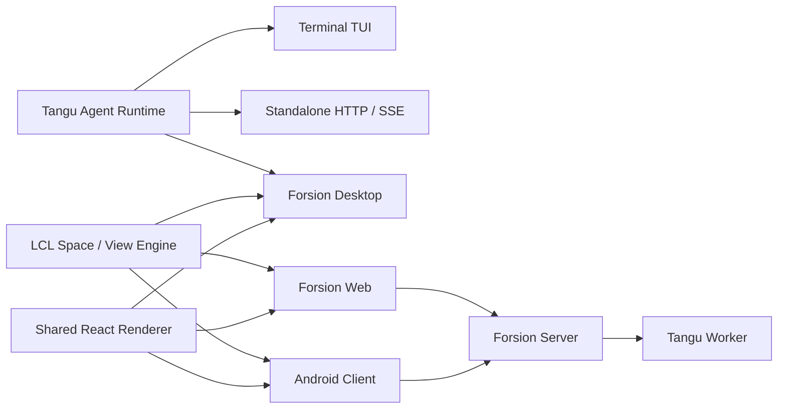

<div align="center">


# Forsion

**Your local AI workbench.**<br>
Bring agents, knowledge, and everyday work together.

**English** · [简体中文](./README.zh-CN.md)

[](https://github.com/Changan-Su/Forsion/releases)

[](./LICENSE)

[Download](https://github.com/Changan-Su/Forsion/releases/latest) · [Quick start](./docs/getting-started/quickstart.en.md) · [Website](https://forsion.net)

</div>

<p align="center">
  
  <br><sub>Real desktop capture: the Agent conversation and project preview share one workspace.</sub>
</p>

## Three ways to use Forsion

### Turn source material into notes

Ask an Agent to turn source files into a local Markdown note, within the access you authorize. Continue editing and linking it in **Note (Amadeus)**.

<p align="center">
  
  <br><sub>The real Note editor with public sample content.</sub>
</p>

### Build a webpage from an idea

In **Coding Studio**, turn an idea into a local webpage project with an Agent. The main screenshot shows its conversation and preview, where you can inspect and refine the result.

### Keep track of what happens next

View dates and to-dos from your note databases in **Calendar**. Configure authorized follow-up tasks in **Automation** and receive their results in **Inbox**.

<p align="center">
  
  <br><sub>Real desktop capture: dates, to-dos, and database records in one view.</sub>
</p>

## Download and start

Download the latest desktop installer from [GitHub Releases](https://github.com/Changan-Su/Forsion/releases/latest).

| Platform | Release artifact | Notes |
| --- | --- | --- |
| macOS | `Forsion-*.dmg` | Apple Silicon (arm64). |
| Windows | `Forsion-*.exe` | NSIS installer. |
| Linux | `Forsion-*.AppImage` | Add execute permission, then run. |

1. **Install and open Forsion.** First launch guides you through the connection, model, theme, and workspace. The desktop app includes the Agent backend and a Node.js runtime.
2. **Connect a model.** Sign in to Forsion, add your own API connection or local Ollama, or use a supported subscription login in local mode. Choose your model in **Settings → Models**.
3. **Try one task in Agent.** Paste a short piece of source material and ask: “Organize this into a note and save it to my knowledge base.” Review any requested access, then open **Note** to check and edit the result.

See the [English quick start](./docs/getting-started/quickstart.en.md) for the first conversation, notes, and automation. The [full documentation](./docs/README.md) is currently in Chinese.

> **Installer signing:** macOS builds use ad-hoc signing and are not yet notarized; Windows builds may trigger SmartScreen. Download from this repository's Releases. If Gatekeeper blocks the first open on macOS, right-click the app and choose “Open”, or allow it in **System Settings → Privacy & Security**.

## Three principles

- **Your data starts locally.** Notes, files, conversations, and configuration live on your device by default. They can be inspected and backed up; Forsion Cloud is an optional connection layer. Requests to a cloud model are sent to the provider you choose.
- **AI can act on the work.** Within the permissions you configure, Agents can read material, edit files, run tools, and carry out follow-up tasks. Memory, skills, and MCP help them work with your context.
- **Shape your own workspace.** Split panels, move tabs, open independent windows, and save layouts. Themes, plugins, skills, Agents, and custom Spaces are installed as local files that you can inspect and change.

<p align="center">
  
</p>

## Six built-in Spaces

A Space is a working context inside the same workbench. These Spaces share workspace files, search, layouts, and Agent capabilities.

| Space | What you can do |
| --- | --- |
| **Agent (Tangu)** | Talk through a task and let an Agent use project files, tools, skills, memory, and delegated sub-tasks. Connect installed external engines such as Claude Code and Codex. |
| **Note (Amadeus)** | Keep local Markdown notes, bidirectional links, backlinks, tags, graph views, databases, attachments, whiteboards, and PDF annotations. |
| **Calendar** | View dated records and to-dos from note databases with filters and views across databases. |
| **Inbox** | Read Agent results, local notifications, and Forsion service messages; manage unread and archived messages. |
| **Coding Studio** | Put the project brief, conversation, source files, and live webpage preview in one workspace. |
| **Automation** | Configure triggers and action chains, schedule Agent tasks, and review their execution history and results. |

<details>
<summary>More about models, tools, and the workspace</summary>

### Agents and models

- OpenAI-compatible endpoints, local Ollama, Forsion-hosted models, and supported subscription logins.
- Tool approvals, file-access boundaries, commands, background tasks, browser and image tools, a Docker Python sandbox, and bundled Computer Use tools for supported desktop platforms.
- MCP, editable skills, folder-based Agents, long-term memory, group chat, sub-task delegation, and instructions added while a task is running.
- External Agent CLIs such as Claude Code and Codex via ACP, with permission requests handled by Forsion.
- Muse can follow configured schedules and rules, sending results to Inbox under its configured permissions and budget.

### Knowledge and layouts

- Notes and attachments are stored in local Vaults, readable and backed up by ordinary file tools.
- Databases support table, board, calendar, and gallery views, with filters, sorting, relations, grouping, and rollups.
- Quick find can jump to notes, databases, and chat sessions.
- Sidebars, tabs, split panels, cross-window dragging, floating Mini cards, and layout restoration keep different working contexts in one app.

</details>

## Where Your Data Lives

The official desktop build uses, by default:

| Path | Contents |
| --- | --- |
| `~/.forsion/` | Account, settings, Agent data, sessions, skills, plugins and local databases. |
| `~/Forsion/` | User-visible workspace, knowledge base and project files. |

The dev build uses separate `~/.forsion-dev/` and `~/Forsion-Dev/` so it won't pollute production data. Legacy `~/.tangu` / `~/Tangu` data is migrated by the desktop app, which keeps a compatibility entry point.

Back up these two directories regularly, just like ordinary documents. Before running high-privilege Agent tasks, confirm the approval tier and the current working directory.

## For developers

**Forsion Genesis** is the source repository for the product family: the Tangu Agent runtime, the LCL Space / View / Plugin engine, Desktop, Web, Android, and product profiles such as Amadeus.

See [web/README.md](./web/README.md) for Web deployment and [mobile/README.md](./mobile/README.md) for Android builds. Expand below for all development commands and the architecture.

<details>
<summary>Development, deployment, and architecture</summary>

## Local Development

### Requirements

- Node.js 20 or newer;
- npm and Git;
- The native build toolchain for your target platform when building installers;
- JDK 17 and the Android SDK additionally for Android builds;
- Docker only when using the Python sandbox or container deployment.

### Run the Desktop App in Dev

```bash
git clone https://github.com/Changan-Su/Forsion.git
cd Forsion

# Build the Agent backend embedded in the desktop app first
cd tangu-agent
npm ci
npm run build

# Then start the Electron desktop app
cd ../desktop
npm ci
npm run dev
```

The `desktop` `postinstall` automatically sets up the LCL dependency links. Keep the existing directory relationships from the repository root — do not copy `desktop/` or `lcl/` on their own.

Common commands:

| Directory | Command | Purpose |
| --- | --- | --- |
| `tangu-agent/` | `npm run build` | Compile the Agent runtime. |
| `tangu-agent/` | `npm run typecheck` | Check types and plugin-API sync status. |
| `tangu-agent/` | `npm test` | Run the runtime tests. |
| `desktop/` | `npm run dev` | Start the desktop dev environment. |
| `desktop/` | `npm run typecheck` | Check desktop types. |
| `desktop/` | `npm test` | Run desktop unit tests. |
| `desktop/` | `npm run build` | Build the Electron main process, preload and renderer. |
| `desktop/` | `npm run dist` | Produce an installer for the current platform. |
| `desktop/` | `npm run e2e:editor` | Run the Amadeus editor end-to-end tests. |

### Run the TUI or Headless Service

```bash
cd tangu-agent
npm ci
npm run build

# Optional: copy and edit local config
mkdir -p ~/.tangu
cp example.env ~/.tangu/.env

npm run tui       # Terminal interface
npm run server    # HTTP / SSE service, default 127.0.0.1:8787
```

`example.env` shows how to configure local models, OpenAI-compatible providers, Forsion Cloud, databases, the sandbox and the worker. Never commit real tokens or API keys to the repository.

### Build Other Product Profiles

The default profile is Forsion, with all six Spaces. The repository also provides an Amadeus profile that does not bundle the Agent backend or the app marketplace:

```bash
cd desktop
npm run dev:amadeus
npm run build:amadeus
npm run pack:amadeus
```

When adding a new product, define its product identity, default Spaces, feature set and backend capabilities in `desktop/products/`, and add profile tests.

## Web & Deployment

### Web Local Development

Forsion Web reuses the desktop rendering layer and connects to a running Forsion Server. The default dev address is `http://localhost:5273`, with the backend proxy target at `http://localhost:3001`.

```bash
cd web
cp .env.example .env
npm ci
npm run dev
```

### Web Container Deployment

The Docker build context must be the repository root, because Web reads source from `desktop/frontend`, `desktop/shared` and `lcl`.

```bash
BACKEND_URL=http://host.docker.internal:3001 \
  docker compose -f web/docker-compose.yml up -d --build
```

The site is published to host port `8090` by default. See [web/README.md](./web/README.md) for full reverse-proxy, environment-variable, HTTPS and troubleshooting notes.

### Android

The mobile client is primarily Android / Capacitor, reusing the desktop rendering layer with a single-column interface. It is currently better suited for development and validating mobile workflows than as a full replacement for the desktop app. See [mobile/README.md](./mobile/README.md) for build steps and deep-link login requirements.

## Architecture



The Tangu Agent isolates storage, models, billing and runtime environment through the `host`, `brain`, `billing` and `profile` seams; LCL splits interface capabilities into registrable Spaces and Views. Combined, the same business capability can be reused across the local desktop, self-hosted services and cloud-connected clients.

### Repository Structure

```text
Forsion/
├── tangu-agent/   # Agent runtime, TUI, standalone, tools, skills & plugin API
├── lcl/           # Space / View / Plugin workspace engine
├── desktop/       # Electron main process, shared React renderer & product profiles
├── web/           # Vite + nginx browser client
├── mobile/        # Capacitor Android client
├── archived/      # Read-only historical implementations
└── Dockerfile.standalone
```

### Client Status

| Form | Role | Status |
| --- | --- | --- |
| Desktop | The full Forsion workbench for everyday use | Primary release target |
| TUI / Standalone | Terminal use, scripting integration and local service | Available, maintained alongside the runtime |
| Web | A standalone web client connected to Forsion Server | Self-hostable, depends on the server |
| Mobile | Android cloud connection and mobile workflows | Under active development |

## Testing & Release

Before committing, at least run the type checks and tests relevant to your changes:

```bash
cd tangu-agent
npm run typecheck
npm test

cd ../desktop
npm run typecheck
npm test
```

The release workflow is triggered by `v*` tags: it first checks Tangu Agent types and tests, then builds installers on macOS, Windows and Linux runners respectively, and finally creates or updates the GitHub Release. You can also run the build manually from the Actions page and download the Artifacts.

User-visible desktop changes should be recorded in [desktop/CHANGELOG.md](./desktop/CHANGELOG.md).

</details>

## Contributing

Issues and Pull Requests are welcome. To make problems easier to reproduce and merge:

1. When filing a bug, include the Forsion version, operating system, reproduction steps, expected behavior and any necessary logs;
2. Search existing issues before development, and keep each Pull Request focused on one clear problem;
3. Do not commit `.env`, tokens, local databases, workspace content or build artifacts;
4. Behavior changes need added or updated tests, and user-visible changes need a Changelog update;
5. When modifying the shared rendering layer, consider the capability differences and runtime gating across Desktop, Web and Mobile.

You can view or file issues from [Issues](https://github.com/Changan-Su/Forsion/issues), or open a Pull Request directly to help improve the project.

## License

Forsion Genesis uses the [Modified Apache License 2.0](./LICENSE). It is based on Apache License 2.0 with additional conditions, mainly covering:

- You may not use this repository's code to operate a multi-tenant environment without written authorization;
- When using the `desktop/`, `web/` or `mobile/` frontends, you may not remove or modify the logo, product name and copyright notices in the interface;
- Commercial use is permitted when the additional conditions are met; a commercial license should be obtained for multi-tenant deployment or other authorizations.

Please read the full license text before using, distributing or offering services based on this project. This license includes restrictions beyond Apache-2.0, so it should not be understood as the standard Apache-2.0 license alone.
