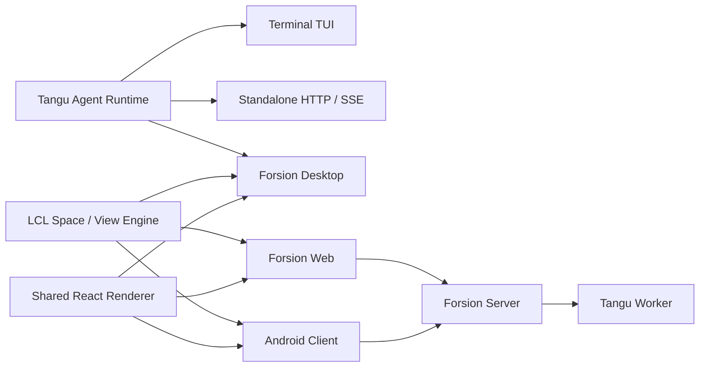

<div align="center">


# Forsion

**A second brain you own.**<br>
Remembers your context. Thinks with you. Follows through.

**English** · [简体中文](./README.zh-CN.md)

[](https://github.com/Changan-Su/Forsion/releases)

[](./LICENSE)

[Download](https://github.com/Changan-Su/Forsion/releases/latest) · [Quick start](./docs/getting-started/quickstart.en.md) · [Documentation (中文)](./docs/README.md) · [Website](https://forsion.net)

</div>

Forsion is a **local-first second brain**. Keep research, ideas, and projects in your own knowledge base. Work with Agents that carry long-term memory, let Muse follow up on ongoing work, and add tools and workflows through plugins.

**Build knowledge → Think with context → Take action → Bring results back.** Each new task can build on what came before.

| Knowledge & memory | Multi-agent collaboration | Proactive follow-up | Extensions |
| --- | --- | --- | --- |
| Notes, links, and long-term memory | Multi-agent discussions and parallel subtasks | Proactive Muse and automation | Plugins, skills, and custom Spaces |

## Give your work lasting context

Your **Amadeus knowledge base** holds the material you collect, the ideas you develop, and the work you finish. **Agent memory** holds preferences, facts, and project context gathered while working with you. Keep the sources close and carry useful context into the next conversation.

- **Connect your material.** Local Markdown, bidirectional links, backlinks, and a graph view. Reference attachments, databases, and conversations from notes to keep conclusions connected to their sources.
- **Organize your thinking.** Manage projects through table, board, calendar, and gallery views. Explore ideas on a whiteboard, annotate PDFs, and assemble research in dashboards.
- **Manage what Agents remember.** Each Agent has its own personality, Library, logs, and memory settings. Inspect, revise, consolidate, or forget facts in the memory panel. Historian maintains conversation logs and memory candidates; when enabled, Dream consolidates memories and candidates, while recall searches history within the Agent's scope.

<p align="center">
  
  <br><sub>Actual Note workspace in Forsion Desktop v2.10.4, with public sample data.</sub>
</p>

[Explore the knowledge base (中文)](./docs/amadeus/overview.md) · [Agent memory (中文)](./docs/agents/memory.md)

## Muse: a second brain that follows up

Give ongoing work to **Muse, the proactive Agent**. Once enabled, Muse wakes on heartbeats, schedules, and rules. It uses recent work and its own memory to prepare material, suggest next steps, or carry out tasks within the permissions and budget you set.

- **Keep an eye on ongoing work.** Hand a task from a conversation to Muse for tracking, or configure a scheduled or event-based rule. Heartbeats give it regular opportunities to review what needs attention.
- **Bring decisions to you.** Results arrive in Inbox. Task cards let you ask Muse to execute, start a new conversation, or dismiss a suggestion. Approve or reject pending actions in the message itself.
- **Build a workspace of its own.** Muse has a Library and work journals. It can also write and gradually improve its own Space, organizing ongoing work into a browsable interface.

Muse is off by default and currently runs in local mode. Configure active hours, frequency, budget, and approval mode; activity awareness is a separate opt-in. For repeatable processes, **Automation** connects time, events, or database changes to action chains involving Agents, notifications, and database operations.

[Muse (中文)](./docs/agents/muse.md) · [Automation (中文)](./docs/spaces/automation.md) · [Inbox (中文)](./docs/spaces/inbox.md)

## Multiple Agents, shared work

Create Agents for research, writing, development, or everyday planning, each with its own personality, model, Library, and tool permissions. Discuss a problem from several perspectives, or divide independent work into parallel subtasks.

| Collaboration mode | How to use it |
| --- | --- |
| **Multi-agent group chat** | Let different roles respond, challenge assumptions, and develop a proposal in turns. Agents vote on whether to continue each round; you can interject or @ a participant. |
| **Parallel subtasks** | Delegate independent research, implementation, or checks, pass the context each task needs, and have the main Agent bring the results together. |
| **Self-brainstorming** | Explore several perspectives on a problem, compare alternatives, and form a conclusion. |
| **External Agent engines** | Connect locally installed engines such as Claude Code and Codex through ACP, bringing them into Forsion conversations and workspaces. |

Group chat, subtask execution, and these external engines use local mode. The knowledge base provides material you can authorize Agents to access, while their memory and tool settings remain individually manageable.

[Agents (中文)](./docs/agents/overview.md) · [Group chat (中文)](./docs/chat/group-chat.md) · [External engines (中文)](./docs/agents/external-engines.md)

## A plugin system for a growing second brain

Extensions can change both **what your AI can do** and **how you work with it**. Plugins can add tools, note features, workspace views, automation events, or an entire Space.

- **Install a workflow together.** A plugin bundle can deliver an interface, engine tools, Agents, skills, and Spaces, all managed from one place.
- **Connect collection to action.** For example, Bluebird turns videos into notes; Computer Use lets Agents operate desktop applications on supported platforms; plugin events can trigger automation.
- **Turn experience into reusable capability.** Skills capture ways of working, and MCP connects external tools and data. The marketplace offers plugins, Agents, skills, Spaces, themes, and web apps. Ask an Agent to use the built-in extension development skill to create an extension of your own.

[Plugins and extension points (中文)](./docs/customization/plugins.md) · [Marketplace (中文)](./docs/customization/market.md) · [Skills (中文)](./docs/agents/skills.md)

## Put it together in one project

For a research project, you could build up this workflow:

1. **Collect context.** Bring articles, PDFs, and saved material into your knowledge base. Link sources, open questions, and project notes.
2. **Develop a judgment.** Ask research and review Agents to compare approaches, delegate independent investigations, and save the conclusions with their evidence.
3. **Make something.** Review and edit notes, code, images, or webpages directly in Agent Desk. For an interactive prototype, continue building and previewing it in Coding Studio.
4. **Keep it moving.** Assign follow-up work to Muse or Automation, check dates and to-dos in Calendar, and respond to suggestions in Inbox. Add new conclusions and outputs to the project note.

This is a suggested workflow you can configure. You choose model connections, access to material, Muse settings, and plugins.

<p align="center">
  
  <br><sub>Coding Studio is one place to create an output. Forsion Desktop v2.10.4, with public sample data.</sub>
</p>

<details>
<summary>Calendar: bring dates and to-dos from your knowledge base into your day</summary>

<p align="center">
  
  <br><sub>Actual Calendar workspace in Forsion Desktop v2.10.4, with public sample data.</sub>
</p>

</details>

## Work in an environment you control

- **Arrange the workspace.** Spaces, split panels, draggable tabs, independent windows, and Mini Panel let you place conversations, sources, outputs, and plugin views where they fit. Restore layouts when you return.
- **Choose your models.** Use Forsion-hosted models, your own API connection, OpenAI-compatible endpoints, local Ollama, or supported subscription logins.
- **Continue elsewhere.** Talk to Agents through configured WeChat, Telegram, or QQ channels. Web and Android clients provide cloud-connected access, with capabilities that differ from Desktop.
- **Keep access to your data.** Inspect and back up local notes and files, and view or edit Agent memory. Cloud-model requests go to the provider you choose; enabling account sync or sharing sends the corresponding content to the cloud.

[Workspace (中文)](./docs/getting-started/workspace.md) · [Channels (中文)](./docs/chat/channels.md) · [Client capabilities (中文)](./docs/reference/web-and-mobile.md) · [Data and privacy (中文)](./docs/reference/data-and-privacy.md)

## Download and start

Download the latest desktop installer from [GitHub Releases](https://github.com/Changan-Su/Forsion/releases/latest).

| Platform | Release artifact | Notes |
| --- | --- | --- |
| macOS | `Forsion-*.dmg` | Apple Silicon (arm64). |
| Windows | `Forsion-*.exe` | NSIS installer. |
| Linux | `Forsion-*.AppImage` | Add execute permission, then run. |

1. **Install and connect a model.** First launch helps configure your connection, model, and workspace. The desktop installer includes the Agent backend and Node.js runtime.
2. **Bring some real context.** Create a project note with a goal, sources, and next steps. Ask an Agent to read it, and explicitly tell it a preference worth remembering.
3. **Arrange a follow-up.** In local mode, enable Muse with the permissions and budget you choose, or create an automation rule. Review the result in Inbox.

The [quick start](./docs/getting-started/quickstart.en.md) walks through this path and introduces multi-agent work and plugins.

> **Installer signing:** macOS builds use ad-hoc signing and are not yet notarized; Windows builds may trigger SmartScreen. Download from this repository's Releases. If Gatekeeper blocks the first open on macOS, right-click the app and choose “Open”, or allow it in **System Settings → Privacy & Security**.

## Where Your Data Lives

The official desktop build uses, by default:

| Path | Contents |
| --- | --- |
| `~/.forsion/` | Account, settings, Agent data, sessions, skills, plugins and local databases. |
| `~/Forsion/` | User-visible workspace, knowledge base and project files. |

The dev build uses separate `~/.forsion-dev/` and `~/Forsion-Dev/` so it won't pollute production data. Legacy `~/.tangu` / `~/Tangu` data is migrated by the desktop app, which keeps a compatibility entry point.

Back up these two directories regularly, just like ordinary documents. Before running high-privilege Agent tasks, confirm the approval tier and the current working directory.

## For developers

**Forsion Genesis** is the source repository for the product family: the Tangu Agent runtime, the LCL Space / View / Plugin engine, Desktop, Web, Android, and product profiles such as Amadeus.

See [web/README.md](./web/README.md) for Web deployment and [mobile/README.md](./mobile/README.md) for Android builds. Expand below for all development commands and the architecture.

<details>
<summary>Development, deployment, and architecture</summary>

## Local Development

### Requirements

- Node.js 20 or newer;
- npm and Git;
- The native build toolchain for your target platform when building installers;
- JDK 17 and the Android SDK additionally for Android builds;
- Docker only when using the Python sandbox or container deployment.

### Run the Desktop App in Dev

```bash
git clone https://github.com/Changan-Su/Forsion.git
cd Forsion

# Build the Agent backend embedded in the desktop app first
cd tangu-agent
npm ci
npm run build

# Then start the Electron desktop app
cd ../desktop
npm ci
npm run dev
```

The `desktop` `postinstall` automatically sets up the LCL dependency links. Keep the existing directory relationships from the repository root — do not copy `desktop/` or `lcl/` on their own.

Common commands:

| Directory | Command | Purpose |
| --- | --- | --- |
| `tangu-agent/` | `npm run build` | Compile the Agent runtime. |
| `tangu-agent/` | `npm run typecheck` | Check types and plugin-API sync status. |
| `tangu-agent/` | `npm test` | Run the runtime tests. |
| `desktop/` | `npm run dev` | Start the desktop dev environment. |
| `desktop/` | `npm run typecheck` | Check desktop types. |
| `desktop/` | `npm test` | Run desktop unit tests. |
| `desktop/` | `npm run build` | Build the Electron main process, preload and renderer. |
| `desktop/` | `npm run dist` | Produce an installer for the current platform. |
| `desktop/` | `npm run e2e:editor` | Run the Amadeus editor end-to-end tests. |

### Run the TUI or Headless Service

```bash
cd tangu-agent
npm ci
npm run build

# Optional: copy and edit local config
mkdir -p ~/.tangu
cp example.env ~/.tangu/.env

npm run tui       # Terminal interface
npm run server    # HTTP / SSE service, default 127.0.0.1:8787
```

`example.env` shows how to configure local models, OpenAI-compatible providers, Forsion Cloud, databases, the sandbox and the worker. Never commit real tokens or API keys to the repository.

### Build Other Product Profiles

The default profile is Forsion, with all six Spaces. The repository also provides an Amadeus profile that does not bundle the Agent backend or the app marketplace:

```bash
cd desktop
npm run dev:amadeus
npm run build:amadeus
npm run pack:amadeus
```

When adding a new product, define its product identity, default Spaces, feature set and backend capabilities in `desktop/products/`, and add profile tests.

## Web & Deployment

### Web Local Development

Forsion Web reuses the desktop rendering layer and connects to a running Forsion Server. The default dev address is `http://localhost:5273`, with the backend proxy target at `http://localhost:3001`.

```bash
cd web
cp .env.example .env
npm ci
npm run dev
```

### Web Container Deployment

The Docker build context must be the repository root, because Web reads source from `desktop/frontend`, `desktop/shared` and `lcl`.

```bash
BACKEND_URL=http://host.docker.internal:3001 \
  docker compose -f web/docker-compose.yml up -d --build
```

The site is published to host port `8090` by default. See [web/README.md](./web/README.md) for full reverse-proxy, environment-variable, HTTPS and troubleshooting notes.

### Android

The mobile client is primarily Android / Capacitor, reusing the desktop rendering layer with a single-column interface. It is currently better suited for development and validating mobile workflows than as a full replacement for the desktop app. See [mobile/README.md](./mobile/README.md) for build steps and deep-link login requirements.

## Architecture



The Tangu Agent isolates storage, models, billing and runtime environment through the `host`, `brain`, `billing` and `profile` seams; LCL splits interface capabilities into registrable Spaces and Views. Combined, the same business capability can be reused across the local desktop, self-hosted services and cloud-connected clients.

### Repository Structure

```text
Forsion/
├── tangu-agent/   # Agent runtime, TUI, standalone, tools, skills & plugin API
├── lcl/           # Space / View / Plugin workspace engine
├── desktop/       # Electron main process, shared React renderer & product profiles
├── web/           # Vite + nginx browser client
├── mobile/        # Capacitor Android client
├── archived/      # Read-only historical implementations
└── Dockerfile.standalone
```

### Client Status

| Form | Role | Status |
| --- | --- | --- |
| Desktop | The full Forsion workbench for everyday use | Primary release target |
| TUI / Standalone | Terminal use, scripting integration and local service | Available, maintained alongside the runtime |
| Web | A standalone web client connected to Forsion Server | Self-hostable, depends on the server |
| Mobile | Android cloud connection and mobile workflows | Under active development |

## Testing & Release

Before committing, at least run the type checks and tests relevant to your changes:

```bash
cd tangu-agent
npm run typecheck
npm test

cd ../desktop
npm run typecheck
npm test
```

The release workflow is triggered by `v*` tags: it first checks Tangu Agent types and tests, then builds installers on macOS, Windows and Linux runners respectively, and finally creates or updates the GitHub Release. You can also run the build manually from the Actions page and download the Artifacts.

User-visible desktop changes should be recorded in [desktop/CHANGELOG.md](./desktop/CHANGELOG.md).

</details>

## Contributing

Issues and Pull Requests are welcome. To make problems easier to reproduce and merge:

1. When filing a bug, include the Forsion version, operating system, reproduction steps, expected behavior and any necessary logs;
2. Search existing issues before development, and keep each Pull Request focused on one clear problem;
3. Do not commit `.env`, tokens, local databases, workspace content or build artifacts;
4. Behavior changes need added or updated tests, and user-visible changes need a Changelog update;
5. When modifying the shared rendering layer, consider the capability differences and runtime gating across Desktop, Web and Mobile.

You can view or file issues from [Issues](https://github.com/Changan-Su/Forsion/issues), or open a Pull Request directly to help improve the project.

## License

Forsion Genesis uses the [Modified Apache License 2.0](./LICENSE). It is based on Apache License 2.0 with additional conditions, mainly covering:

- You may not use this repository's code to operate a multi-tenant environment without written authorization;
- When using the `desktop/`, `web/` or `mobile/` frontends, you may not remove or modify the logo, product name and copyright notices in the interface;
- Commercial use is permitted when the additional conditions are met; a commercial license should be obtained for multi-tenant deployment or other authorizations.

Please read the full license text before using, distributing or offering services based on this project. This license includes restrictions beyond Apache-2.0, so it should not be understood as the standard Apache-2.0 license alone.
