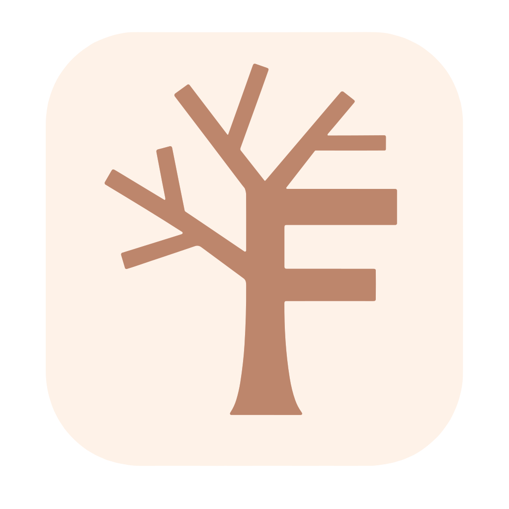
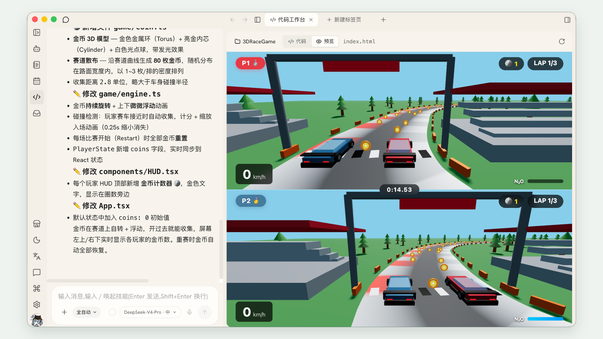
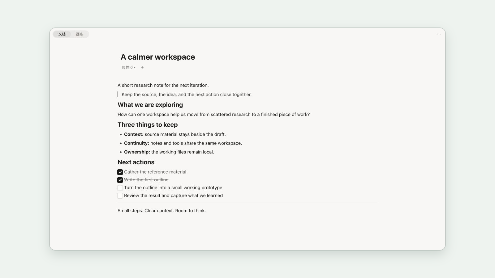
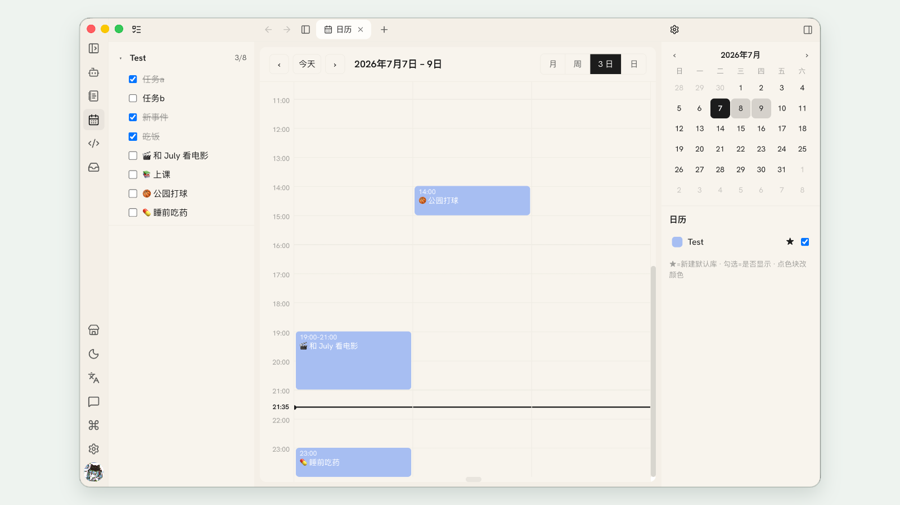
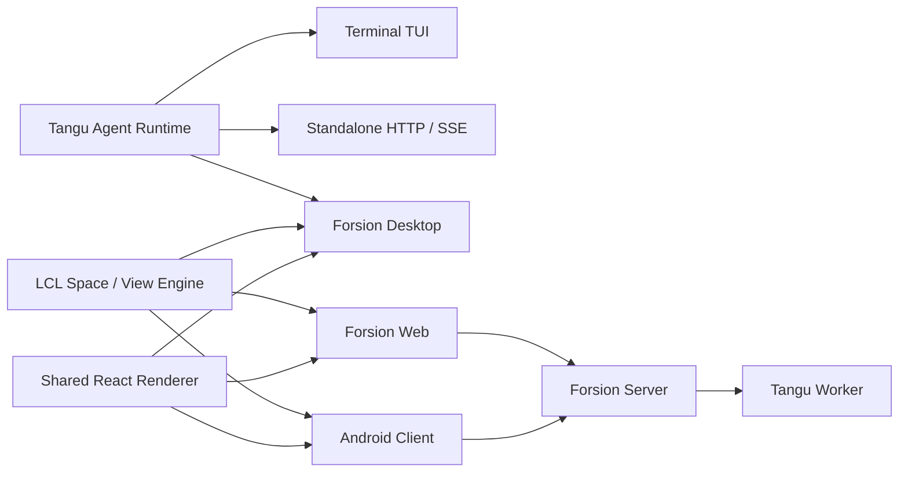

<div align="center">



# Forsion

**你的本地 AI 工作台。**<br>
让知识、智能体与日常工作连起来。

[English](./README.md) · **简体中文**

[](https://github.com/Changan-Su/Forsion/releases)

[](./LICENSE)

[立即下载](https://github.com/Changan-Su/Forsion/releases/latest) · [快速上手](./docs/getting-started/quickstart.md) · [使用文档](./docs/README.md) · [官方网站](https://forsion.net)

</div>

<p align="center">
  
  <br><sub>真实桌面截图：Agent 对话与项目预览位于同一个工作区。</sub>
</p>

## 用 Forsion 完成三件事

### 把资料整理成笔记

授权 Agent 读取资料，把它们整理成本地 Markdown 笔记。在 **Note（Amadeus 笔记）** 中继续编辑，补充双链。

<p align="center">
  
  <br><sub>真实 Note 编辑器，内容使用公开样例数据。</sub>
</p>

### 从一个想法，做出可预览的网页

在**编码工作室**中，和 Agent 把想法变成本地网页项目。主图展示的对话与预览，让你边看成果边继续修改。

### 安排日程，让后续工作送到收件箱

在**日历**中汇总笔记多维表里的日期和待办。在**自动化**中配置并授权后续任务，让结果送到**收件箱**。

<p align="center">
  
  <br><sub>真实桌面截图：日期、待办与多维表记录集中显示。</sub>
</p>

## 下载与开始使用

从 [GitHub Releases](https://github.com/Changan-Su/Forsion/releases/latest) 下载最新桌面安装包。

| 平台 | 发布产物 | 说明 |
| --- | --- | --- |
| macOS | `Forsion-*.dmg` | Apple Silicon（arm64）。 |
| Windows | `Forsion-*.exe` | NSIS 安装程序。 |
| Linux | `Forsion-*.AppImage` | 添加执行权限后运行。 |

1. **安装并打开 Forsion。** 首次引导会帮助你选择连接方式、模型、主题和工作区。桌面安装版包含 Agent 后端和 Node.js 运行时。
2. **连上模型。** 可以登录 Forsion、接入自己的 API 或本地 Ollama，也可以在本地模式下使用支持的订阅登录。在**设置 → 模型**中选择要用的模型。
3. **在 Agent 中试一个任务。** 粘贴一小段资料，发送：“把这段资料整理成一篇笔记，保存到我的知识库。”检查请求的访问权限，再到 **Note** 查看和修改结果。

完整的第一次对话、笔记和自动化操作见[快速上手](./docs/getting-started/quickstart.md)。

> **安装包签名说明：** macOS 构建使用 ad-hoc 签名，尚未经过 Apple 公证；Windows 构建也可能触发 SmartScreen。请从本仓库 Releases 下载。macOS 首次打开若被 Gatekeeper 拦截，可右键应用选择“打开”，或在**系统设置 → 隐私与安全性**中允许打开。

## 三个原则

- **数据先在本地。** 笔记、文件、会话与配置默认保存在你的设备上，便于检查和备份；Forsion Cloud 是可选的连接层。使用云端模型时，请求会发送给你选择的服务商。
- **AI 可以参与行动。** 在你配置的权限范围内，Agent 可以读取资料、编辑文件、调用工具并执行后续任务。记忆、技能和 MCP 帮助它使用你的工作上下文。
- **工作台由你组合。** 分栏、拖动标签、打开独立窗口并保存布局。主题、插件、技能、Agent 和自定义 Space 以本地文件安装，可以检查和修改。

<p align="center">
  
</p>

## 六个内置 Space

Space 是同一个工作台中的工作语境。这些空间共享工作区文件、搜索、布局和 Agent 能力。

| Space | 可以做什么 |
| --- | --- |
| **Agent（Tangu 智能体）** | 讨论与执行任务，使用项目文件、工具、技能、记忆和子任务委派；接入本机已安装的 Claude Code、Codex 等外部引擎。 |
| **Note（Amadeus 笔记）** | 管理本地 Markdown 笔记、双链、反向链接、标签、关系图、多维表、附件、白板与 PDF 批注。 |
| **日历** | 汇总笔记多维表里的日期和待办，按条件筛选并跨库查看。 |
| **收件箱** | 阅读 Agent 产出、本地通知与 Forsion 服务消息，管理未读与归档。 |
| **编码工作室** | 把项目简报、对话、源码文件与实时网页预览放在同一个工作区。 |
| **自动化** | 配置触发条件和动作链，安排 Agent 任务，查看执行记录与结果。 |

<details>
<summary>更多模型、工具与工作区能力</summary>

### Agent 与模型

- OpenAI 兼容接口、本地 Ollama、Forsion 托管模型，以及支持的订阅登录。
- 工具审批、文件访问边界、命令执行、后台任务、浏览器和图像工具、Docker Python 沙箱，以及支持平台上的内置 Computer Use 工具。
- MCP、可编辑技能、文件夹化 Agent、长期记忆、群聊、子任务委派与运行中追加指令。
- 通过 ACP 接入 Claude Code、Codex 等外部 Agent CLI，由 Forsion 处理权限请求。
- Muse 按配置的日程和规则跟进工作，在设定的权限与预算内把产出送到收件箱。

### 知识与布局

- 笔记和附件直接保存在本地 Vault 中，可用普通文件工具读取和备份。
- 多维表支持表格、看板、日历和画廊视图，以及筛选、排序、关联、分组与统计。
- 全局快速查找可以跳转到笔记、多维表与聊天会话。
- 侧栏、标签页、分栏、跨窗口拖拽、Mini 悬浮卡片与布局恢复，让不同工作语境留在一个应用里。

</details>

## 数据存放位置

正式桌面版默认使用：

| 路径 | 内容 |
| --- | --- |
| `~/.forsion/` | 账号、设置、Agent 数据、会话、技能、插件与本地数据库。 |
| `~/Forsion/` | 用户可见的工作区、知识库和项目文件。 |

开发版使用独立的 `~/.forsion-dev/` 与 `~/Forsion-Dev/`，不会污染正式版数据。旧版 `~/.tangu` / `~/Tangu` 数据会由桌面端迁移并保留兼容入口。

建议像备份普通文档一样定期备份这两个目录。执行高权限 Agent 任务前，请确认审批档位与当前工作目录。

## 开发者入口

**Forsion Genesis** 是产品家族源码仓，包含 Tangu Agent 运行时、LCL Space / View / Plugin 引擎、Desktop、Web、Android，以及 Amadeus 等产品档案。

Web 部署见 [web/README.md](./web/README.md)，Android 构建见 [mobile/README.md](./mobile/README.md)。展开下方查看完整开发命令与架构。

<details>
<summary>开发、部署与架构</summary>

## 本地开发

### 环境要求

- Node.js 20 或更高版本；
- npm 与 Git；
- 构建安装包时，需要目标平台的原生编译工具链；
- Android 构建额外需要 JDK 17 与 Android SDK；
- Docker 仅在使用 Python 沙箱或容器部署时需要。

### 启动桌面开发版

```bash
git clone https://github.com/Changan-Su/Forsion.git
cd Forsion

# 先构建桌面端内嵌的 Agent 后端
cd tangu-agent
npm ci
npm run build

# 再启动 Electron 桌面端
cd ../desktop
npm ci
npm run dev
```

`desktop` 的 `postinstall` 会自动建立 LCL 依赖链接。请从仓库根目录保持现有目录关系，不要单独复制 `desktop/` 或 `lcl/`。

常用命令：

| 目录 | 命令 | 用途 |
| --- | --- | --- |
| `tangu-agent/` | `npm run build` | 编译 Agent 运行时。 |
| `tangu-agent/` | `npm run typecheck` | 检查类型与插件 API 同步状态。 |
| `tangu-agent/` | `npm test` | 运行运行时测试。 |
| `desktop/` | `npm run dev` | 启动桌面开发环境。 |
| `desktop/` | `npm run typecheck` | 检查桌面端类型。 |
| `desktop/` | `npm test` | 运行桌面端单元测试。 |
| `desktop/` | `npm run build` | 构建 Electron 主进程、preload 与渲染层。 |
| `desktop/` | `npm run dist` | 为当前平台生成安装包。 |
| `desktop/` | `npm run e2e:editor` | 运行 Amadeus 编辑器端到端测试。 |

### 运行 TUI 或无头服务

```bash
cd tangu-agent
npm ci
npm run build

# 可选：复制并编辑本地配置
mkdir -p ~/.tangu
cp example.env ~/.tangu/.env

npm run tui       # 终端界面
npm run server    # HTTP / SSE 服务，默认 127.0.0.1:8787
```

`example.env` 展示了本地模型、OpenAI 兼容 Provider、Forsion 云端、数据库、沙箱和 worker 的配置方式。不要将真实 Token 或 API Key 提交到仓库。

### 构建其他产品档案

默认档案是包含六个 Space 的 Forsion。仓库还提供不捆绑 Agent 后端和应用市场的 Amadeus 档案：

```bash
cd desktop
npm run dev:amadeus
npm run build:amadeus
npm run pack:amadeus
```

新增产品时，在 `desktop/products/` 中定义产品身份、默认 Space、功能集合和后端能力，并补充档案测试。

## Web 与服务部署

### Web 本地开发

Forsion Web 复用桌面渲染层，并连接一个正在运行的 Forsion Server。默认开发地址是 `http://localhost:5273`，后端代理目标是 `http://localhost:3001`。

```bash
cd web
cp .env.example .env
npm ci
npm run dev
```

### Web 容器部署

Docker 构建上下文必须是仓库根目录，因为 Web 会读取 `desktop/frontend`、`desktop/shared` 和 `lcl` 的源码。

```bash
BACKEND_URL=http://host.docker.internal:3001 \
  docker compose -f web/docker-compose.yml up -d --build
```

站点默认发布到宿主机 `8090` 端口。完整的反向代理、环境变量、HTTPS 与排障说明见 [web/README.md](./web/README.md)。

### Android

移动端以 Android / Capacitor 为主，复用桌面渲染层并替换为单列界面。目前它更适合参与开发和验证移动工作流，而不是作为桌面版的完整替代品。构建步骤与深链登录要求见 [mobile/README.md](./mobile/README.md)。

## 架构



Tangu Agent 通过 `host`、`brain`、`billing` 与 `profile` 接缝隔离存储、模型、计费和运行环境；LCL 则把界面能力拆成可注册的 Space 与 View。两者结合后，同一套业务能力可以在本地桌面、自托管服务和云连接客户端之间复用。

### 仓库结构

```text
Forsion/
├── tangu-agent/   # Agent 运行时、TUI、standalone、工具、技能与插件 API
├── lcl/           # Space / View / Plugin 工作区引擎
├── desktop/       # Electron 主进程、共享 React 渲染层与产品档案
├── web/           # Vite + nginx 的浏览器客户端
├── mobile/        # Capacitor Android 客户端
├── archived/      # 只读历史实现
└── Dockerfile.standalone
```

### 各端状态

| 形态 | 定位 | 状态 |
| --- | --- | --- |
| Desktop | 日常使用的完整 Forsion 工作台 | 主要发布目标 |
| TUI / Standalone | 终端使用、脚本集成与本地服务 | 可用，随运行时共同维护 |
| Web | 连接 Forsion Server 的独立 Web 客户端 | 可自托管，依赖服务端 |
| Mobile | Android 云连接与移动工作流 | 持续开发中 |

## 测试与发布

提交前至少运行与你改动相关的类型检查和测试：

```bash
cd tangu-agent
npm run typecheck
npm test

cd ../desktop
npm run typecheck
npm test
```

发布工作流由 `v*` 标签触发：先检查 Tangu Agent 类型与测试，再分别在 macOS、Windows 和 Linux Runner 构建安装包，最后创建或更新 GitHub Release。也可以在 Actions 页面手动运行构建并下载 Artifacts。

用户可见的桌面变化应同步写入 [desktop/CHANGELOG.md](./desktop/CHANGELOG.md)。

</details>

## 参与贡献

欢迎提交 Issue 和 Pull Request。为了让问题更容易复现和合并：

1. 提交 Bug 时，请包含 Forsion 版本、操作系统、复现步骤、预期行为和必要日志；
2. 开发前先搜索已有 Issue，并将一次 Pull Request 聚焦在一个明确问题上；
3. 不要提交 `.env`、Token、本地数据库、工作区内容或构建产物；
4. 行为变更需要补充或更新测试，用户可见变化需要更新 Changelog；
5. 修改共享渲染层时，请同时考虑 Desktop、Web 和 Mobile 的能力差异与运行时门控。

你可以从 [Issues](https://github.com/Changan-Su/Forsion/issues) 查看或提交问题，也欢迎直接发起 Pull Request 参与改进。

## 许可

Forsion Genesis 使用 [Modified Apache License 2.0](./LICENSE)。它以 Apache License 2.0 为基础，并包含额外条件，主要涉及：

- 未经书面授权，不得使用本仓库代码运营多租户环境；
- 使用 `desktop/`、`web/` 或 `mobile/` 前端时，不得移除或修改界面中的 Logo、产品名称与版权信息；
- 符合附加条件时可以商业使用；需要多租户部署或其他授权时，应取得商业许可。

请在使用、分发或基于本项目提供服务前阅读完整许可文本。该许可包含 Apache-2.0 之外的限制，因此不应仅按标准 Apache-2.0 许可理解。
