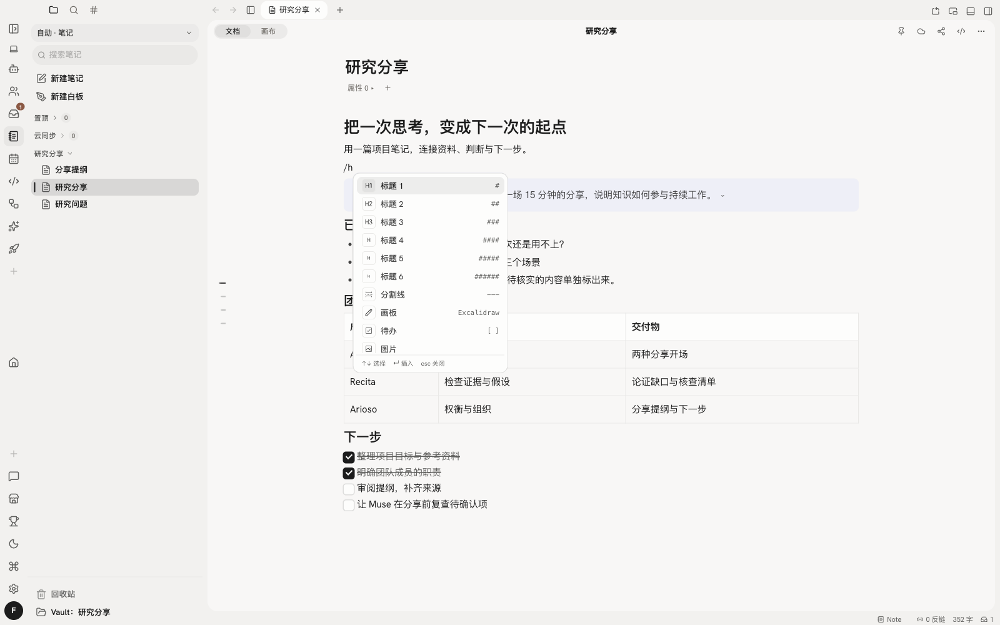
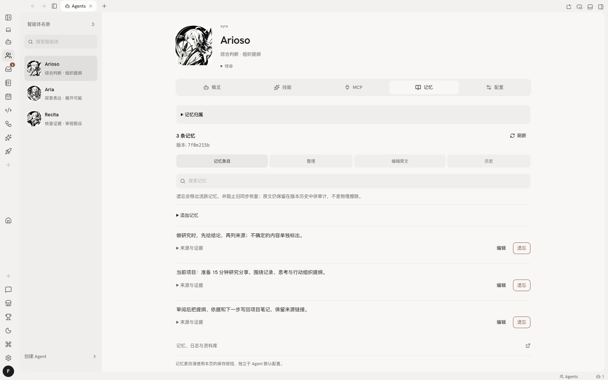
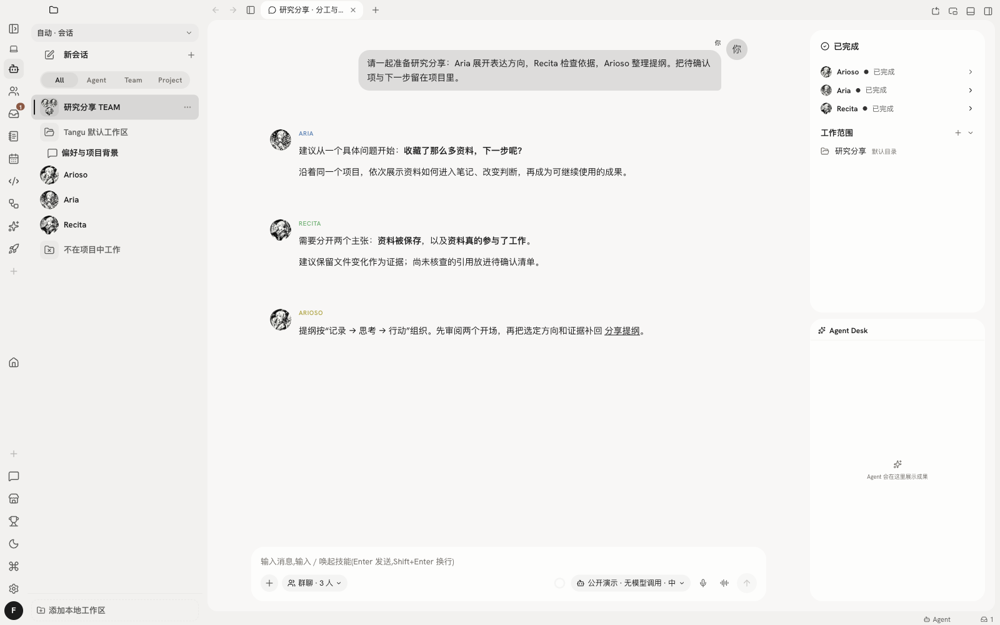
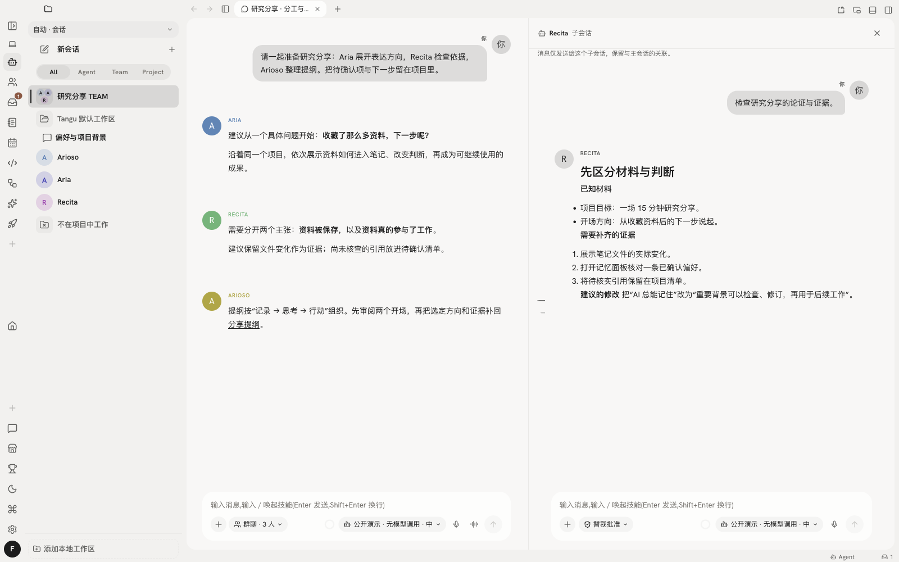
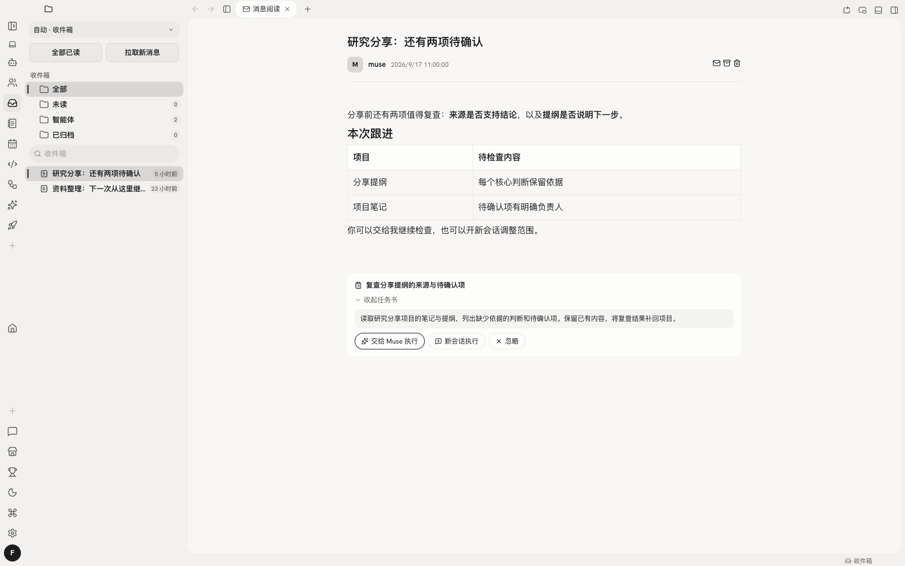
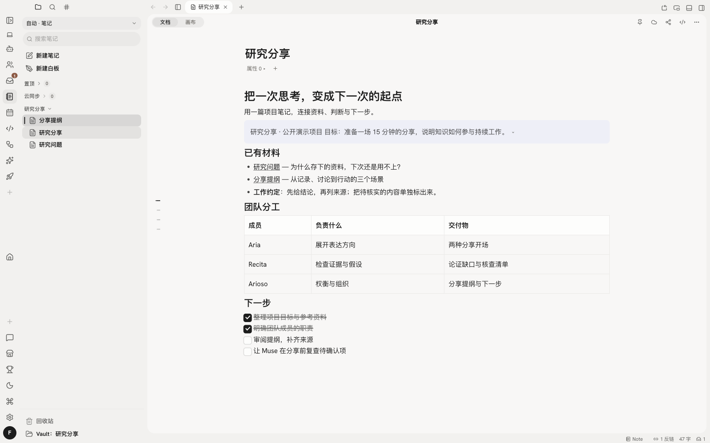
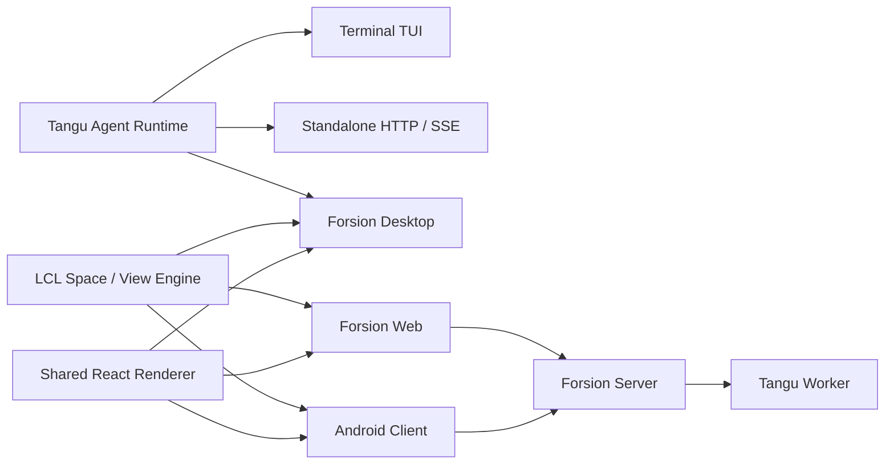

<div align="center">


# Forsion

**不止记下来，还能接着做下去。**<br>
你的本地优先 AI 第二大脑。

[English](./README.md) · **简体中文**

[](https://github.com/Changan-Su/Forsion/releases)

[](./LICENSE)

[立即下载](https://github.com/Changan-Su/Forsion/releases/latest) · [快速上手](./docs/getting-started/quickstart.md) · [使用文档](./docs/README.md) · [官方网站](https://forsion.net)

</div>

Forsion（扶桑）是一个**本地优先的 AI 第二大脑**。用 Notion 风格的块编辑器整理自己的 Markdown 文件，让有长期记忆的 Agent 带着背景与你思考，用 TEAM 分工推进项目，再让 Muse 在你设定的范围内持续跟进。

**把一次思考，变成下一次的起点。** 资料、偏好、讨论、成果与后续，在同一个工作台里接起来。

| 第二大脑的一部分 | 在 Forsion 里如何工作 |
| --- | --- |
| **记录与连接** | 本地 `.md` 上的块编辑，连接笔记、PDF、白板、多维表与会话。 |
| **记住背景** | 可查看、可修订的长期记忆，让偏好和项目背景跨会话延续。 |
| **一起思考与执行** | 有不同人格的 Agent、可长期配置的 TEAM、并行工作与 Team Desk。 |
| **主动跟进** | Muse 按心跳、日程和规则行动，将结果与待决定事项送到收件箱。 |
| **按需扩展** | 插件把工具、Agent、技能与专属工作空间接进同一条工作流。 |

下面的截图来自 v2.11.0 桌面构建，使用同一套公开研究项目样例；展示真实界面，不代表一次真实模型执行。[截图来源与复现](./.github/assets/showcase/README.md)。

## Markdown 的自由，块编辑的直观

**在本地 `.md` 文件上，获得 Notion 风格的块状编辑体验。** 在 Amadeus 知识库里，标题、段落、待办、代码、嵌入内容都是可组织的块：写作时直接输入 Markdown，用 `/` 插入内容，用分栏安排材料，随时查看块的源码。笔记仍是磁盘上的文件，能直接打开、备份和交给 Agent 读写。

<p align="center">
  
  <br><sub>在本地 Markdown 笔记中用斜杠菜单插入内容块 · v2.11.0 真实界面 · 公开样例数据</sub>
</p>

- **把一页组织清楚。** Markdown 快捷输入、斜杠菜单、分栏、小节折叠、callout、页面图标与封面，让长笔记也有结构。
- **让材料彼此连接。** 用 `[[双链]]`、反向链接与关系图连接想法；嵌入笔记、图片、多维表和白板，在聊天中直接引用笔记。
- **让资料参与工作。** Agent 在授权范围内读取来源、比较方案，把结论和待办写回项目。你与 Agent 使用同一批实际文件。

| 思考和工作的形态 | 对应能力 |
| --- | --- |
| 整理结构化资料与项目 | 多维表：表格、看板、日历、画廊，以及筛选、排序、分组。 |
| 展开关系与推导 | Excalidraw 兼容白板；PDF 批注直接写进 PDF 文件。 |
| 建立自己的项目首页 | 仪表盘组合笔记、多维表、白板、图片与网页卡片。 |
| 把下一步排进日常 | 日历聚合多维表日期与待办，可订阅外部日历。 |

笔记采用本地 Markdown，双链、属性和白板使用兼容格式；分栏、数据库、插件块等扩展内容的呈现取决于打开它们的应用。

[块编辑器](./docs/amadeus/editor.md) · [知识库](./docs/amadeus/overview.md) · [多维表](./docs/amadeus/databases.md) · [白板](./docs/amadeus/whiteboard.md)

## 重要背景，不必每次重新交代

**知识库存材料，记忆留背景。** 完整的文章、证据与产物留在项目里；你明确交代的偏好、事实和持续有用的背景，可以进入 Agent 的长期记忆，让下一次工作有前情可循。

- **记住什么，看得见。** 打开记忆面板查看、修订和整理，检查来源与版本记录，也可以把内容移出活跃记忆。
- **长期伙伴，各有积累。** 每个 Agent 有自己的人格（SOUL）、记忆、Library 和工作日志；模型、工具权限与记忆配置可分别管理。
- **积累可以维护。** Historian 整理日志与记忆候选；按需启用 Dream 归并整理；会话回忆按 Agent 范围检索相关历史。

例如：“做研究时先给结论，再列来源，单独标出不确定项。”确认它已进入记忆后，换一场会话继续同一项目，检查它如何使用这条偏好。自动 Dream 默认关闭；“遗忘”移出活跃记忆，版本历史仍保留。

<p align="center">
  
  <br><sub>打开 Arioso 的记忆面板，查看项目背景与偏好，逐条编辑或遗忘 · v2.11.0 真实界面 · 公开样例数据</sub>
</p>

[了解记忆](./docs/agents/memory.md) · [配置 Agent](./docs/agents/overview.md)

## TEAM：让灵感有人展开，也有人认真挑错

**一个人做项目，也可以有不同视角和持续的分工。** Aria 关注感受与创造性，Recita 检查证据、假设与可行性，Arioso 结合目标与取舍形成独立判断；Coding 聚焦实现，Muse 负责主动跟进。你可以调整它们，也可以创建自己的 Agent。

**v2.11 的 TEAM 把协作变成可持续使用的团队：**

- **团队有共同的约定。** 选两个及以上 Agent 即可开始团队模式；长期团队保存成员、职责与自定义头像，用 `TEAM.md` 写共同目标与协作约定，并有自己的 Library。
- **成员可以同时开工。** 各自在子会话里研究、写作或执行，向主会话发送进度、问题和交接；你可以插话、点名，让讨论与执行围绕同一个目标推进。
- **过程与成果看得见。** Team Desk 展示谁在工作、等待审批或已完成；点开成员查看完整子会话。审批请求和公开产物汇回主会话，便于审阅与接着处理。
- **工作有明确去处。** 私聊中用 `@项目` 派遣任务，在对应项目里新开会话执行。Agents Space 管理 Agent 和团队；“轨道”侧栏把私聊、团队、项目与外部引擎放在同一入口。

也可以在普通会话中委派独立子任务，或通过 ACP 接入本机已安装的 Claude Code、Codex 等外部引擎。团队与这些本地执行能力使用本地模式；任务按需传递背景，各 Agent 的记忆与工具配置仍分别管理。

<p align="center">
  
  <br><sub>Aria、Recita 与 Arioso 的公开讨论，以及 Team Desk 成员状态 · v2.11.0 真实界面 · 公开样例数据</sub>
</p>

<p align="center">
  
  <br><sub>点开 Recita 的子会话，在主讨论旁检查具体依据与建议 · v2.11.0 真实界面 · 公开样例数据</sub>
</p>

[TEAM 与 Team Desk](./docs/chat/group-chat.md) · [Agent 与人格](./docs/agents/overview.md) · [外部引擎](./docs/agents/external-engines.md)

## Muse：交代之后，继续有人留意

**需要继续跟进的事情，可以交给主动式 Agent。** Muse 启用后按心跳、日程和规则醒来，在配置的权限与预算内回顾近期工作、整理资料、提出下一步或执行任务。

- **把后续交出去。** 从对话任务卡交给 Muse 追踪，或设置日程、事件规则；心跳让它定期回看还有什么值得推进。
- **把决定带回来。** 结果进入收件箱。任务卡可交给 Muse 执行、开新会话处理或忽略，待批操作可以批准或拒绝。
- **把持续工作组织起来。** Muse 积累自己的 Library 与日志，还能编写、逐步完善自己的 Space，把资料与工作组织成可浏览的界面。

本版本升级时会将尚未开启的 Muse 与 Historian 一次性打开；升级后你随时可以手动关闭，选择会被保留，不会在下次启动时重新打开。Muse 当前在本地模式运行，需要设备与相应进程保持可用；活跃时段、频率、预算和审批方式由你设置。固定流程可以交给**自动化**，用时间、事件或数据库变化串起 Agent、通知与表格操作。

<p align="center">
  
  <br><sub>Muse 将跟进事项送入收件箱：查看任务书，执行、另开会话或忽略 · v2.11.0 真实界面 · 公开样例数据</sub>
</p>

[主动式 Muse](./docs/agents/muse.md) · [自动化](./docs/spaces/automation.md) · [收件箱](./docs/spaces/inbox.md)

## 插件：把你的工作方式接进来

**第二大脑可以随着你的工作一起扩展。** 一个插件捆绑包可以同时提供界面、引擎工具、Agent、技能和 Space，让收集、处理与产出接在一起。

- **收集与行动。** 青鸟收藏夹把视频整理成笔记；Computer Use 让 Agent 操作支持平台上的桌面应用；插件事件可以触发自动化。
- **复用做事方法。** Skills 保存任务方法，MCP 接入外部工具与数据，插件扩展笔记块、视图和工作空间。
- **建立专属环境。** 从市场安装插件、Agent、技能、Space、主题和网页应用；也可以让 Agent 借助内置扩展开发技能创建自己的扩展。

[插件体系](./docs/customization/plugins.md) · [应用市场](./docs/customization/market.md) · [Skills](./docs/agents/skills.md)

## 从几份资料，到一份能继续推进的研究分享

可以用一个真实项目逐步体验这条路径：

1. **搭一页项目笔记。** 用块编辑组织目标、来源和问题，嵌入 PDF、白板或多维表。
2. **带着背景一起想。** 引用材料，让 Agent 使用已确认的表达偏好；请 Aria 展开方向、Recita 审视依据，和 Arioso 一起权衡方案。
3. **让 TEAM 分工推进。** 把互不依赖的调查、初稿或检查交给成员，在 Team Desk 查看进展与成果。
4. **把判断写回文件。** 审阅结果，让 Agent 保存提纲、来源与待确认项，在 Agent Desk 打开修改。需要网页原型时，继续进入 Coding Studio 制作与预览。
5. **留下一次跟进。** 让 Muse 在约定时间复查，通过收件箱处理结果，再把新结论补回项目。

这是可按需配置的示例路径；实际执行取决于所选模型、资料访问与工具设置。下次回来，项目文件和确认过的背景就是新的起点。

<p align="center">
  
  <br><sub>把来源、团队分工与下一步保留在同一篇本地项目笔记里 · v2.11.0 真实界面 · 公开样例数据</sub>
</p>

## 在你自己的工作环境里

- **摆放思考的材料。** Space、分栏、可拖拽标签、独立窗口和 Mini Panel，让会话、资料与产物并排；布局可以恢复。
- **说话也能推进工作。** 实时语音支持停顿后自动发送；切到其他视图仍可继续通话。
- **选择合适的模型。** Forsion 托管模型、自带 API、OpenAI 兼容接口、本地 Ollama，以及支持的订阅登录。
- **从其他入口联系 Agent。** 配置微信、Telegram 或 QQ 通道；Web 与 Android 提供云连接入口，能力与桌面版有所不同。
- **掌握自己的积累。** 本地文件可直接检查和备份，记忆可以修改。使用云端模型、账号同步或分享时，相应内容会发送到所用服务。

[工作区](./docs/getting-started/workspace.md) · [通道](./docs/chat/channels.md) · [各端能力](./docs/reference/web-and-mobile.md) · [数据与隐私](./docs/reference/data-and-privacy.md)

## 下载与开始使用

从 [GitHub Releases](https://github.com/Changan-Su/Forsion/releases/latest) 下载最新桌面安装包。

| 平台 | 发布产物 | 说明 |
| --- | --- | --- |
| macOS | `Forsion-*.dmg` | Apple Silicon（arm64）。 |
| Windows | `Forsion-*.exe` | NSIS 安装程序。 |
| Linux | `Forsion-*.AppImage` | 添加执行权限后运行。 |

1. **安装并连上模型。** 首次引导帮助你配置连接、模型和工作区，桌面安装版自带 Agent 后端与 Node.js 运行时。
2. **带入真实背景。** 建一篇项目笔记，把目标、参考资料和下一步放进去；让 Agent 读取它，并明确告诉它值得长期记住的偏好。
3. **完成一件小事。** 让 Agent 根据材料生成一份有用的成果，打开文件检查，再到记忆面板确认一条明确保存的偏好。TEAM、Muse 与插件可以之后按需加入。

[快速上手](./docs/getting-started/quickstart.md)会带你完成这条路径，并尝试多 Agent 与插件扩展。

> **安装包签名说明：** macOS 构建使用 ad-hoc 签名，尚未经过 Apple 公证；Windows 构建也可能触发 SmartScreen。请从本仓库 Releases 下载。macOS 首次打开若被 Gatekeeper 拦截，可右键应用选择“打开”，或在**系统设置 → 隐私与安全性**中允许打开。

## 数据存放位置

正式桌面版默认使用：

| 路径 | 内容 |
| --- | --- |
| `~/.forsion/` | 账号、设置、Agent 数据、会话、技能、插件与本地数据库。 |
| `~/Forsion/` | 用户可见的工作区、知识库和项目文件。 |

开发版使用独立的 `~/.forsion-dev/` 与 `~/Forsion-Dev/`，不会污染正式版数据。旧版 `~/.tangu` / `~/Tangu` 数据会由桌面端迁移并保留兼容入口。

建议像备份普通文档一样定期备份这两个目录。执行高权限 Agent 任务前，请确认审批档位与当前工作目录。

## 开发者入口

**Forsion Genesis** 是产品家族源码仓，包含 Tangu Agent 运行时、LCL Space / View / Plugin 引擎、Desktop、Web、Android，以及 Amadeus 等产品档案。

Web 部署见 [web/README.md](./web/README.md)，Android 构建见 [mobile/README.md](./mobile/README.md)。展开下方查看完整开发命令与架构。

<details>
<summary>开发、部署与架构</summary>

## 本地开发

### 环境要求

- Node.js 20 或更高版本；
- npm 与 Git；
- 构建安装包时，需要目标平台的原生编译工具链；
- Android 构建额外需要 JDK 17 与 Android SDK；
- Docker 仅在使用 Python 沙箱或容器部署时需要。

### 启动桌面开发版

```bash
git clone https://github.com/Changan-Su/Forsion.git
cd Forsion

# 先构建桌面端内嵌的 Agent 后端
cd tangu-agent
npm ci
npm run build

# 再启动 Electron 桌面端
cd ../desktop
npm ci
npm run dev
```

`desktop` 的 `postinstall` 会自动建立 LCL 依赖链接。请从仓库根目录保持现有目录关系，不要单独复制 `desktop/` 或 `lcl/`。

常用命令：

| 目录 | 命令 | 用途 |
| --- | --- | --- |
| `tangu-agent/` | `npm run build` | 编译 Agent 运行时。 |
| `tangu-agent/` | `npm run typecheck` | 检查类型与插件 API 同步状态。 |
| `tangu-agent/` | `npm test` | 运行运行时测试。 |
| `desktop/` | `npm run dev` | 启动桌面开发环境。 |
| `desktop/` | `npm run typecheck` | 检查桌面端类型。 |
| `desktop/` | `npm test` | 运行桌面端单元测试。 |
| `desktop/` | `npm run build` | 构建 Electron 主进程、preload 与渲染层。 |
| `desktop/` | `npm run dist` | 为当前平台生成安装包。 |
| `desktop/` | `npm run e2e:editor` | 运行 Amadeus 编辑器端到端测试。 |

### 运行 TUI 或无头服务

```bash
cd tangu-agent
npm ci
npm run build

# 可选：复制并编辑本地配置
mkdir -p ~/.tangu
cp example.env ~/.tangu/.env

npm run tui       # 终端界面
npm run server    # HTTP / SSE 服务，默认 127.0.0.1:8787
```

`example.env` 展示了本地模型、OpenAI 兼容 Provider、Forsion 云端、数据库、沙箱和 worker 的配置方式。不要将真实 Token 或 API Key 提交到仓库。

### 构建其他产品档案

默认档案是包含六个 Space 的 Forsion。仓库还提供不捆绑 Agent 后端和应用市场的 Amadeus 档案：

```bash
cd desktop
npm run dev:amadeus
npm run build:amadeus
npm run pack:amadeus
```

新增产品时，在 `desktop/products/` 中定义产品身份、默认 Space、功能集合和后端能力，并补充档案测试。

## Web 与服务部署

### Web 本地开发

Forsion Web 复用桌面渲染层，并连接一个正在运行的 Forsion Server。默认开发地址是 `http://localhost:5273`，后端代理目标是 `http://localhost:3001`。

```bash
cd web
cp .env.example .env
npm ci
npm run dev
```

### Web 容器部署

Docker 构建上下文必须是仓库根目录，因为 Web 会读取 `desktop/frontend`、`desktop/shared` 和 `lcl` 的源码。

```bash
BACKEND_URL=http://host.docker.internal:3001 \
  docker compose -f web/docker-compose.yml up -d --build
```

站点默认发布到宿主机 `8090` 端口。完整的反向代理、环境变量、HTTPS 与排障说明见 [web/README.md](./web/README.md)。

### Android

移动端以 Android / Capacitor 为主，复用桌面渲染层并替换为单列界面。目前它更适合参与开发和验证移动工作流，而不是作为桌面版的完整替代品。构建步骤与深链登录要求见 [mobile/README.md](./mobile/README.md)。

## 架构



Tangu Agent 通过 `host`、`brain`、`billing` 与 `profile` 接缝隔离存储、模型、计费和运行环境；LCL 则把界面能力拆成可注册的 Space 与 View。两者结合后，同一套业务能力可以在本地桌面、自托管服务和云连接客户端之间复用。

### 仓库结构

```text
Forsion/
├── tangu-agent/   # Agent 运行时、TUI、standalone、工具、技能与插件 API
├── lcl/           # Space / View / Plugin 工作区引擎
├── desktop/       # Electron 主进程、共享 React 渲染层与产品档案
├── web/           # Vite + nginx 的浏览器客户端
├── mobile/        # Capacitor Android 客户端
├── archived/      # 只读历史实现
└── Dockerfile.standalone
```

### 各端状态

| 形态 | 定位 | 状态 |
| --- | --- | --- |
| Desktop | 日常使用的完整 Forsion 工作台 | 主要发布目标 |
| TUI / Standalone | 终端使用、脚本集成与本地服务 | 可用，随运行时共同维护 |
| Web | 连接 Forsion Server 的独立 Web 客户端 | 可自托管，依赖服务端 |
| Mobile | Android 云连接与移动工作流 | 持续开发中 |

## 测试与发布

提交前至少运行与你改动相关的类型检查和测试：

```bash
cd tangu-agent
npm run typecheck
npm test

cd ../desktop
npm run typecheck
npm test
```

发布工作流由 `v*` 标签触发：先检查 Tangu Agent 类型与测试，再分别在 macOS、Windows 和 Linux Runner 构建安装包，最后创建或更新 GitHub Release。也可以在 Actions 页面手动运行构建并下载 Artifacts。

用户可见的桌面变化应同步写入 [desktop/CHANGELOG.md](./desktop/CHANGELOG.md)。

</details>

## 参与贡献

欢迎提交 Issue 和 Pull Request。为了让问题更容易复现和合并：

1. 提交 Bug 时，请包含 Forsion 版本、操作系统、复现步骤、预期行为和必要日志；
2. 开发前先搜索已有 Issue，并将一次 Pull Request 聚焦在一个明确问题上；
3. 不要提交 `.env`、Token、本地数据库、工作区内容或构建产物；
4. 行为变更需要补充或更新测试，用户可见变化需要更新 Changelog；
5. 修改共享渲染层时，请同时考虑 Desktop、Web 和 Mobile 的能力差异与运行时门控。

你可以从 [Issues](https://github.com/Changan-Su/Forsion/issues) 查看或提交问题，也欢迎直接发起 Pull Request 参与改进。

## 许可

Forsion Genesis 使用 [Modified Apache License 2.0](./LICENSE)。它以 Apache License 2.0 为基础，并包含额外条件，主要涉及：

- 未经书面授权，不得使用本仓库代码运营多租户环境；
- 使用 `desktop/`、`web/` 或 `mobile/` 前端时，不得移除或修改界面中的 Logo、产品名称与版权信息；
- 符合附加条件时可以商业使用；需要多租户部署或其他授权时，应取得商业许可。

请在使用、分发或基于本项目提供服务前阅读完整许可文本。该许可包含 Apache-2.0 之外的限制，因此不应仅按标准 Apache-2.0 许可理解。
