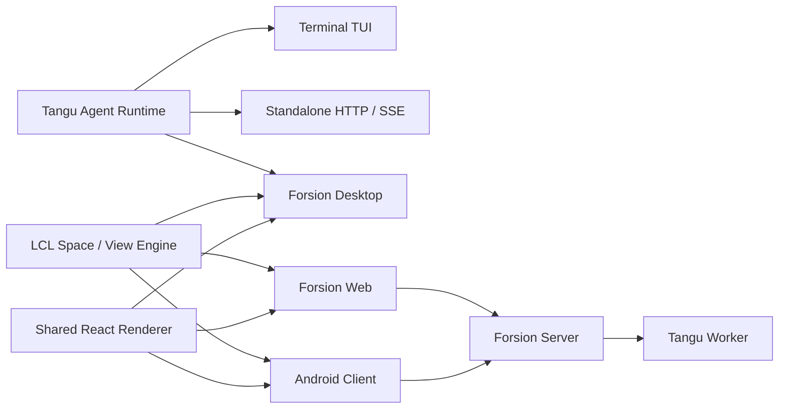

<div align="center">


# Forsion

**你的第二大脑，与你一起思考、主动行动。**<br>
A second brain you own.

[English](./README.md) · **简体中文**

[](https://github.com/Changan-Su/Forsion/releases)

[](./LICENSE)

[立即下载](https://github.com/Changan-Su/Forsion/releases/latest) · [快速上手](./docs/getting-started/quickstart.md) · [使用文档](./docs/README.md) · [官方网站](https://forsion.net)

</div>

Forsion（扶桑）是一个**本地优先的 Second Brain**。把资料、想法与项目留在自己的知识库，让拥有长期记忆的 Agent 理解你的背景，协作完成工作；让 Muse 持续跟进，再用插件把新的工具和工作方式接进来。

**知识积累 → 带着上下文思考 → 主动行动 → 成果回到知识库。** 下一次开始时，接着已有的积累往前走。

| 知识与记忆 | 多 Agent 协作 | 主动跟进 | 插件体系 |
| --- | --- | --- | --- |
| 笔记、双链与长期记忆 | 多 Agent 讨论与并行子任务 | Muse 主动跟进与自动化 | 插件、技能与自定义 Space |

## 让知识成为持续的上下文

**Amadeus 知识库**保存你收集的材料、写下的想法与完成的成果。**Agent 记忆**保存它与你工作时积累的偏好、事实和项目背景。资料有地方沉淀，下一次对话也有前情可循。

- **连接材料。** 本地 Markdown、双向链接、反向链接与关系图；笔记中可以引用附件、多维表和会话，让结论连着来源。
- **组织思考。** 用多维表的表格、看板、日历和画廊视图管理项目，用白板展开想法，用 PDF 批注与仪表盘整理研究。
- **管理记忆。** 每个 Agent 有自己的人格、资料库、日志与记忆配置。记忆面板可以查看、修订、整理和遗忘；Historian 整理会话日志与记忆候选，Dream 在启用后归并记忆与候选，回忆按 Agent 范围查找相关历史。

<p align="center">
  
  <br><sub>Forsion Desktop v2.10.4 的真实 Note 工作区；公开样例数据。</sub>
</p>

[了解知识库](./docs/amadeus/overview.md) · [了解 Agent 记忆](./docs/agents/memory.md)

## Muse：让第二大脑主动跟进

交代过的事情，可以让 **Muse 主动式 Agent** 继续留意。启用后，它按心跳、日程和规则醒来，结合近期工作与自己的记忆，在配置的权限和预算内整理资料、提出下一步或执行任务。

- **持续关注。** 把对话中的任务交给 Muse 追踪，或配置定时、事件规则；心跳让它定期回看还有什么值得推进。
- **把决定送到你面前。** 结果进入收件箱，任务卡可以交给 Muse 执行、开新会话处理或忽略；待批操作也能在消息中批准或拒绝。
- **积累自己的工作。** Muse 有独立的 Library 与工作日志，还能编写并逐步完善自己的 Space，把持续工作的内容组织成可浏览的界面。

Muse 默认关闭，当前运行于本地模式。你可以设置活跃时段、频率、预算和审批方式；活动感知需要另行开启。固定流程则可以交给**自动化**：用时间、事件或数据库变化触发动作链，串起 Agent、通知和表格操作。

[了解 Muse](./docs/agents/muse.md) · [自动化](./docs/spaces/automation.md) · [收件箱](./docs/spaces/inbox.md)

## 多 Agent：一起思考，分工完成

为研究、写作、开发或日常管理建立不同的 Agent，分别配置人格、模型、资料库与工具权限。复杂任务可以在多个视角之间讨论，也可以拆成独立工作并行推进。

| 协作方式 | 适合怎么用 |
| --- | --- |
| **多 Agent 群聊** | 让不同角色轮流回应、质疑和补充方案；每轮投票决定是否继续，你可以随时插话或 @ 某个 Agent。 |
| **并行子任务** | 把可独立推进的研究、实现或检查委派出去，按需传递背景，由主 Agent 汇总结果。 |
| **自我脑暴** | 围绕一个问题展开多个视角，比较备选方案，再形成结论。 |
| **外部 Agent 引擎** | 通过 ACP 接入本机已安装的 Claude Code、Codex 等引擎，把它们接进 Forsion 的会话与工作区。 |

群聊、子任务和这些外部引擎的执行使用本地模式。知识库为任务提供可授权访问的共同材料，各个 Agent 的记忆与工具配置仍可分别管理。

[Agent 总览](./docs/agents/overview.md) · [群聊](./docs/chat/group-chat.md) · [外部引擎](./docs/agents/external-engines.md)

## 插件体系：让第二大脑长出新能力

Forsion 的扩展可以同时改变 **AI 会做什么**与**你怎样处理工作**。插件能提供工具、笔记能力、工作区视图和自动化事件，也能带来完整的 Space。

- **一套工作流，一次安装。** 插件捆绑包可以一起交付界面、引擎工具、Agent、技能和 Space，在同一入口管理。
- **从收集到行动。** 例如青鸟收藏夹把视频整理为笔记；Computer Use 让 Agent 操作支持平台上的桌面应用；插件事件可以接入自动化。
- **把经验变成能力。** Skills 保存可复用的做事方法，MCP 接入外部工具与数据。应用市场提供插件、Agent、技能、Space、主题和网页应用；也可以让 Agent 借助内置扩展开发技能，创建自己的扩展。

[插件与扩展点](./docs/customization/plugins.md) · [应用市场](./docs/customization/market.md) · [Skills](./docs/agents/skills.md)

## 把它们用在同一个项目里

以“准备一个研究项目”为例，可以逐步搭起这样的工作流：

1. **积累资料。** 把文章、PDF 和剪藏内容放进知识库，用双链连接来源、问题与项目笔记。
2. **形成判断。** 请研究与评审 Agent 比较方案，把独立调查交给子任务，保存结论和依据。
3. **产出成果。** 在 Agent Desk 直接查看和编辑笔记、代码、图片或网页；需要交互原型时，进入 Coding Studio 继续制作和预览。
4. **持续推进。** 将后续事项交给 Muse 或自动化，在日历中查看日期与待办，从收件箱处理新建议；将新的结论和产物补回项目笔记。

这是可按需配置的使用路径；模型接入、资料访问、Muse 与插件由你设置。

<p align="center">
  
  <br><sub>Coding Studio 是成果的一种落点。Forsion Desktop v2.10.4；公开样例数据。</sub>
</p>

<details>
<summary>日历：让知识库里的日期和待办进入日常安排</summary>

<p align="center">
  
  <br><sub>Forsion Desktop v2.10.4 的真实日历工作区；公开样例数据。</sub>
</p>

</details>

## 在你自己的工作环境里

- **工作区可以组合。** Space、分栏、可拖拽标签、独立窗口和 Mini Panel，让会话、资料、产物与插件视图按你的习惯摆放，布局可以恢复。
- **模型可以选择。** Forsion 托管模型、自带 API、OpenAI 兼容接口、本地 Ollama，以及支持的订阅登录。
- **工作可以延续。** 通过配置的微信、Telegram 或 QQ 通道与 Agent 交流；Web 与 Android 客户端提供云连接入口，具体能力与桌面版有所不同。
- **数据可以掌握。** 本地笔记与文件可直接检查和备份，Agent 记忆可查看和修改。云端模型请求会发送给所选服务商，启用账号同步或共享时相应内容会上云。

[工作区](./docs/getting-started/workspace.md) · [通道](./docs/chat/channels.md) · [各端能力](./docs/reference/web-and-mobile.md) · [数据与隐私](./docs/reference/data-and-privacy.md)

## 下载与开始使用

从 [GitHub Releases](https://github.com/Changan-Su/Forsion/releases/latest) 下载最新桌面安装包。

| 平台 | 发布产物 | 说明 |
| --- | --- | --- |
| macOS | `Forsion-*.dmg` | Apple Silicon（arm64）。 |
| Windows | `Forsion-*.exe` | NSIS 安装程序。 |
| Linux | `Forsion-*.AppImage` | 添加执行权限后运行。 |

1. **安装并连上模型。** 首次引导帮助你配置连接、模型和工作区，桌面安装版自带 Agent 后端与 Node.js 运行时。
2. **带入真实背景。** 建一篇项目笔记，把目标、参考资料和下一步放进去；让 Agent 读取它，并明确告诉它值得长期记住的偏好。
3. **安排一次跟进。** 在本地模式下按需启用 Muse、设置权限和预算，或建立一条自动化规则；再到收件箱查看结果。

[快速上手](./docs/getting-started/quickstart.md)会带你完成这条路径，并尝试多 Agent 与插件扩展。

> **安装包签名说明：** macOS 构建使用 ad-hoc 签名，尚未经过 Apple 公证；Windows 构建也可能触发 SmartScreen。请从本仓库 Releases 下载。macOS 首次打开若被 Gatekeeper 拦截，可右键应用选择“打开”，或在**系统设置 → 隐私与安全性**中允许打开。

## 数据存放位置

正式桌面版默认使用：

| 路径 | 内容 |
| --- | --- |
| `~/.forsion/` | 账号、设置、Agent 数据、会话、技能、插件与本地数据库。 |
| `~/Forsion/` | 用户可见的工作区、知识库和项目文件。 |

开发版使用独立的 `~/.forsion-dev/` 与 `~/Forsion-Dev/`，不会污染正式版数据。旧版 `~/.tangu` / `~/Tangu` 数据会由桌面端迁移并保留兼容入口。

建议像备份普通文档一样定期备份这两个目录。执行高权限 Agent 任务前，请确认审批档位与当前工作目录。

## 开发者入口

**Forsion Genesis** 是产品家族源码仓，包含 Tangu Agent 运行时、LCL Space / View / Plugin 引擎、Desktop、Web、Android，以及 Amadeus 等产品档案。

Web 部署见 [web/README.md](./web/README.md)，Android 构建见 [mobile/README.md](./mobile/README.md)。展开下方查看完整开发命令与架构。

<details>
<summary>开发、部署与架构</summary>

## 本地开发

### 环境要求

- Node.js 20 或更高版本；
- npm 与 Git；
- 构建安装包时，需要目标平台的原生编译工具链；
- Android 构建额外需要 JDK 17 与 Android SDK；
- Docker 仅在使用 Python 沙箱或容器部署时需要。

### 启动桌面开发版

```bash
git clone https://github.com/Changan-Su/Forsion.git
cd Forsion

# 先构建桌面端内嵌的 Agent 后端
cd tangu-agent
npm ci
npm run build

# 再启动 Electron 桌面端
cd ../desktop
npm ci
npm run dev
```

`desktop` 的 `postinstall` 会自动建立 LCL 依赖链接。请从仓库根目录保持现有目录关系，不要单独复制 `desktop/` 或 `lcl/`。

常用命令：

| 目录 | 命令 | 用途 |
| --- | --- | --- |
| `tangu-agent/` | `npm run build` | 编译 Agent 运行时。 |
| `tangu-agent/` | `npm run typecheck` | 检查类型与插件 API 同步状态。 |
| `tangu-agent/` | `npm test` | 运行运行时测试。 |
| `desktop/` | `npm run dev` | 启动桌面开发环境。 |
| `desktop/` | `npm run typecheck` | 检查桌面端类型。 |
| `desktop/` | `npm test` | 运行桌面端单元测试。 |
| `desktop/` | `npm run build` | 构建 Electron 主进程、preload 与渲染层。 |
| `desktop/` | `npm run dist` | 为当前平台生成安装包。 |
| `desktop/` | `npm run e2e:editor` | 运行 Amadeus 编辑器端到端测试。 |

### 运行 TUI 或无头服务

```bash
cd tangu-agent
npm ci
npm run build

# 可选：复制并编辑本地配置
mkdir -p ~/.tangu
cp example.env ~/.tangu/.env

npm run tui       # 终端界面
npm run server    # HTTP / SSE 服务，默认 127.0.0.1:8787
```

`example.env` 展示了本地模型、OpenAI 兼容 Provider、Forsion 云端、数据库、沙箱和 worker 的配置方式。不要将真实 Token 或 API Key 提交到仓库。

### 构建其他产品档案

默认档案是包含六个 Space 的 Forsion。仓库还提供不捆绑 Agent 后端和应用市场的 Amadeus 档案：

```bash
cd desktop
npm run dev:amadeus
npm run build:amadeus
npm run pack:amadeus
```

新增产品时，在 `desktop/products/` 中定义产品身份、默认 Space、功能集合和后端能力，并补充档案测试。

## Web 与服务部署

### Web 本地开发

Forsion Web 复用桌面渲染层，并连接一个正在运行的 Forsion Server。默认开发地址是 `http://localhost:5273`，后端代理目标是 `http://localhost:3001`。

```bash
cd web
cp .env.example .env
npm ci
npm run dev
```

### Web 容器部署

Docker 构建上下文必须是仓库根目录，因为 Web 会读取 `desktop/frontend`、`desktop/shared` 和 `lcl` 的源码。

```bash
BACKEND_URL=http://host.docker.internal:3001 \
  docker compose -f web/docker-compose.yml up -d --build
```

站点默认发布到宿主机 `8090` 端口。完整的反向代理、环境变量、HTTPS 与排障说明见 [web/README.md](./web/README.md)。

### Android

移动端以 Android / Capacitor 为主，复用桌面渲染层并替换为单列界面。目前它更适合参与开发和验证移动工作流，而不是作为桌面版的完整替代品。构建步骤与深链登录要求见 [mobile/README.md](./mobile/README.md)。

## 架构



Tangu Agent 通过 `host`、`brain`、`billing` 与 `profile` 接缝隔离存储、模型、计费和运行环境；LCL 则把界面能力拆成可注册的 Space 与 View。两者结合后，同一套业务能力可以在本地桌面、自托管服务和云连接客户端之间复用。

### 仓库结构

```text
Forsion/
├── tangu-agent/   # Agent 运行时、TUI、standalone、工具、技能与插件 API
├── lcl/           # Space / View / Plugin 工作区引擎
├── desktop/       # Electron 主进程、共享 React 渲染层与产品档案
├── web/           # Vite + nginx 的浏览器客户端
├── mobile/        # Capacitor Android 客户端
├── archived/      # 只读历史实现
└── Dockerfile.standalone
```

### 各端状态

| 形态 | 定位 | 状态 |
| --- | --- | --- |
| Desktop | 日常使用的完整 Forsion 工作台 | 主要发布目标 |
| TUI / Standalone | 终端使用、脚本集成与本地服务 | 可用，随运行时共同维护 |
| Web | 连接 Forsion Server 的独立 Web 客户端 | 可自托管，依赖服务端 |
| Mobile | Android 云连接与移动工作流 | 持续开发中 |

## 测试与发布

提交前至少运行与你改动相关的类型检查和测试：

```bash
cd tangu-agent
npm run typecheck
npm test

cd ../desktop
npm run typecheck
npm test
```

发布工作流由 `v*` 标签触发：先检查 Tangu Agent 类型与测试，再分别在 macOS、Windows 和 Linux Runner 构建安装包，最后创建或更新 GitHub Release。也可以在 Actions 页面手动运行构建并下载 Artifacts。

用户可见的桌面变化应同步写入 [desktop/CHANGELOG.md](./desktop/CHANGELOG.md)。

</details>

## 参与贡献

欢迎提交 Issue 和 Pull Request。为了让问题更容易复现和合并：

1. 提交 Bug 时，请包含 Forsion 版本、操作系统、复现步骤、预期行为和必要日志；
2. 开发前先搜索已有 Issue，并将一次 Pull Request 聚焦在一个明确问题上；
3. 不要提交 `.env`、Token、本地数据库、工作区内容或构建产物；
4. 行为变更需要补充或更新测试，用户可见变化需要更新 Changelog；
5. 修改共享渲染层时，请同时考虑 Desktop、Web 和 Mobile 的能力差异与运行时门控。

你可以从 [Issues](https://github.com/Changan-Su/Forsion/issues) 查看或提交问题，也欢迎直接发起 Pull Request 参与改进。

## 许可

Forsion Genesis 使用 [Modified Apache License 2.0](./LICENSE)。它以 Apache License 2.0 为基础，并包含额外条件，主要涉及：

- 未经书面授权，不得使用本仓库代码运营多租户环境；
- 使用 `desktop/`、`web/` 或 `mobile/` 前端时，不得移除或修改界面中的 Logo、产品名称与版权信息；
- 符合附加条件时可以商业使用；需要多租户部署或其他授权时，应取得商业许可。

请在使用、分发或基于本项目提供服务前阅读完整许可文本。该许可包含 Apache-2.0 之外的限制，因此不应仅按标准 Apache-2.0 许可理解。
