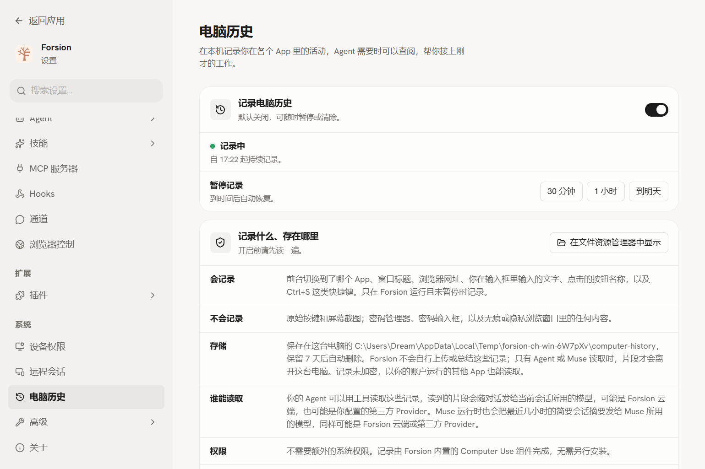
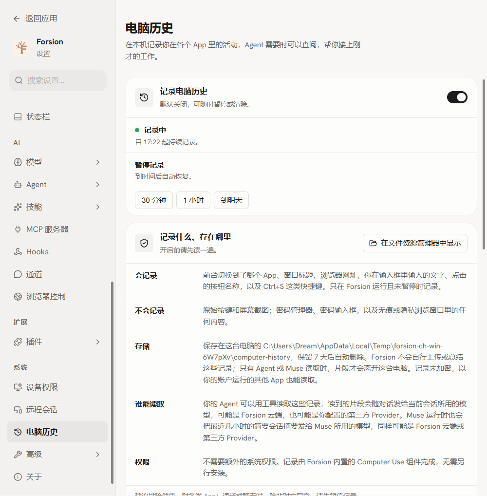
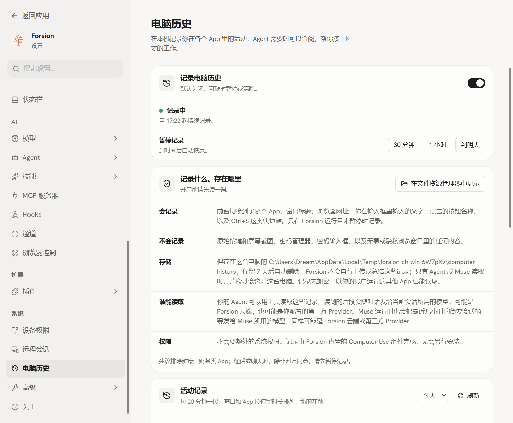

# Windows 电脑历史与 App Dock 验证（2026-10-06）

对应 [#13](https://github.com/Changan-Su/Forsion/issues/13)。桌面基线为 main `e6ce02c3`，ComputerUse 为 main `771e6e82ad606a85715930516439a80fb1ed3b32` 的 release 演练产物。

## 发现并修复的问题

1. `check:computerhistory` 原来只查找 macOS 浏览器路径，Windows 上找不到 Chromium；改用项目已有的跨平台查找器。
2. 编辑器台架通过 `spawn('npx', ..., shell:false)` 起 Vite，Windows 的 `.cmd` 无法直接启动；改为用当前 Node 执行已安装的 Vite JS 入口，测试子进程也使用当前 Node。
3. 电脑历史单测的假助手使用 Unix socket，Windows 上监听失败；改用真正的 Windows 命名管道，并立即报告监听错误。
4. 磁盘错误测试依赖 POSIX chmod，Windows 上无法产生要求的错误；改为只在测试自己的临时目录内设置 NTFS deny ACL，验证拒绝访问、错误呈现、关闭持久化和恢复重试。Windows 的 EPERM 与 POSIX 的 EACCES 都接受。
5. 增加 Windows CI：设置页、相关单测、实际 Electron 与 Windows 采集器协议/IPC/同意界面/显示器缩放/关闭后的自然退出。

## 本机结果

环境：Windows 11，主屏真实缩放 150%，两台副屏真实缩放 125%。使用隔离的 TANGU_HOME、userData、LOCALAPPDATA 和命名管道；其他当前窗口所属应用全部排除。以下截图和日志只含测试数据。

| 检查 | 结果 |
| --- | --- |
| 电脑历史、Windows resolver、App Dock、UI model 与工具组单测 | 105 通过，1 项 POSIX shebang 测试在 Windows 有意跳过 |
| ComputerHistorySettings 组件单测 | 26 通过 |
| 设置页 Chromium 回归 | 72 通过，0 失败 |
| 实际 Windows Electron + 采集器探针 | 18 通过，包含进程存在及退订后自然退出 |
| Desktop 类型检查 | 通过 |
| main 生产构建 | 通过 |

实际 Electron 探针会在主屏与两个副屏之间移动它自己的设置窗口，核对 `devicePixelRatio` 与操作系统显示器比例一致，检查内容无横向溢出。App Dock 的 Windows IPC 返回 `unsupported_platform`，命令面板分别搜索中文和英文时没有 Dock 命令。

另用 Sky 原生输入操作隔离的 `Forsion-History-Probe.exe`：普通输入 `Forsion history 42` 被实际采集；密码输入框中的假字符串没有被采集；按 exe 名排除后新输入不被记录；清空立即返回空历史，再输入 `AfterClear13` 正常记录。关闭后采集器自行退出。该测试没有输入或上传真实密码、浏览历史、工作内容。

日志：[采集器与 Electron 回归](assets/windows-computer-history-2026-10-06/windows-probe.log)、[设置页 72 项](assets/windows-computer-history-2026-10-06/settings-harness.log)、[105 项单测](assets/windows-computer-history-2026-10-06/history-units.log)、[26 项组件单测](assets/windows-computer-history-2026-10-06/settings-units.log)、[原生测试的脱敏结果](assets/windows-computer-history-2026-10-06/native-input.json)。

## 上游真实 Windows 桌面验证

[windows-recorder-probe 的 main 运行](https://github.com/Changan-Su/Tangu-Computer-Use/actions/runs/37486536276) 已确认成功：Rust 逻辑测试 18 项、真实 Windows 桌面检查 21 项均通过，包含记事本输入/菜单点击/快捷键、Chrome 网址去除 query、网页输入与密码框、Chrome 无痕、Edge InPrivate、agent 改变前台时 `origin=agent`、退订后无 hook/订阅者。

这部分是上游 CI 证据，不冒充本机手动使用 Chrome/Edge 或真实模型调用。

## 发布条件与未实测项

Forsion 仍固定依赖 ComputerUse 0.6.1，该包不含 Windows 采集器。本机通过 `PI_COMPUTER_USE_WINDOWS_HELPER_PATH` 指向演练构建的官方上游产物验证新功能；这不等于普通安装包已经带上它。

[ComputerUse 0.7.0 发布演练](https://github.com/Changan-Su/Tangu-Computer-Use/actions/runs/37490696564) 的 Windows、Linux 双架构、macOS 双架构签名、包内容校验和打包均通过，npm 与 GitHub Release 发布步骤按演练规则跳过。下一步需要发布该提交的 v0.7.0，再把 Forsion 的精确依赖、锁文件和最低捆绑版本升级到 0.7.0，并用不带 override 的探针验证。

Windows exe SHA-256：`402f83c69b41e1d68a34c24ad53dbf2e4b0f798ec67cb89a06df5d6e97e05686`；`recorder-protocol` 输出 13。

没有进行真实锁屏/解锁，也没有用带逗号或中文文件名的原生应用手动输入。相关解析单测已通过，但不能据此把这两项原生验收勾成完成。锁屏期间的停止逻辑已做代码检查，仍需原生验收。
